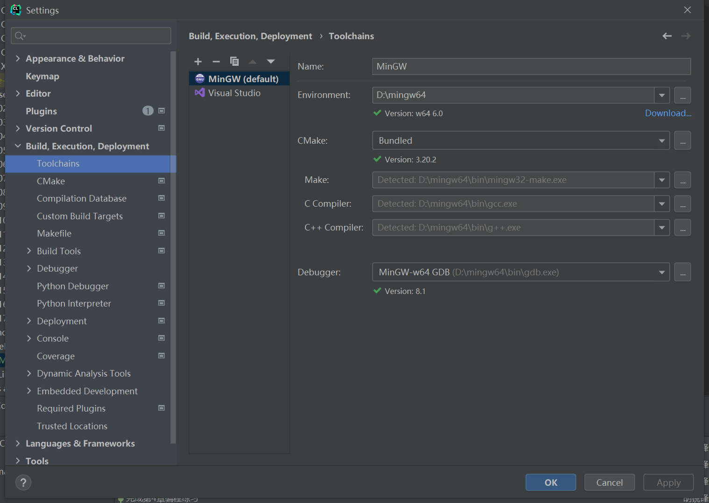
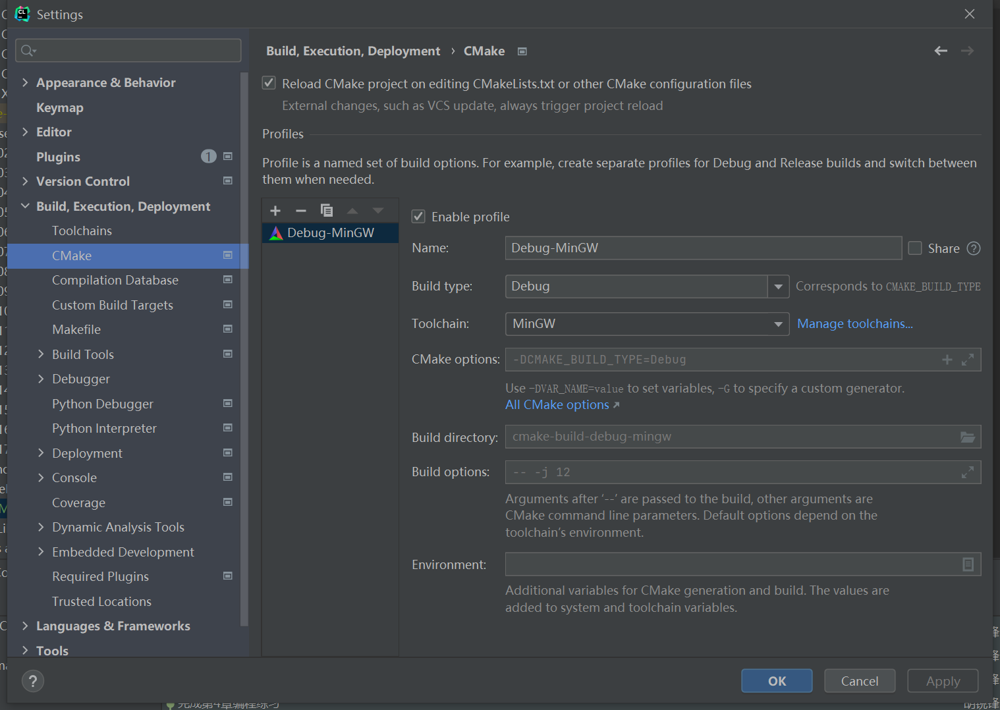

# C Primer Plus (第6版)编程练习解答

&emsp;&emsp;本书详细讲解了C语言的基本概念和编程技巧，第1章、第2章主要介绍C语言的概念和简单示例，从第3章~第15章详细讲解C语言的相关知识，包括数据类型、格式化输入/输出、运算符、表达式、语句、循环、字符输入/输出、函数、数组和指针、字符和字符串函数、内存管理、文件输入和输出、结构、位操作等，最后两章（第16、17章）主要介绍了C预处理器、C的基本库和高级数据结构（链表、队列、二叉树、ADT抽象对象）。  
&emsp;&emsp;本项目主要完成了该书章末的编程练习，结合了[C Primer Plus 第6版 中文版习题解答](https://www.epubit.com/bookDetails?id=UBb600b59872ba)中配套资源的代码，消缺了代码中的一些Bug，例如：第17章习题8中打印所有宠物出现的错误数据问题。

## 在线阅读地址
https://relph1119.github.io/c-primer-plus/#/

## 完善内容
1. 第14章习题14.7，提供书籍数据创建的代码及运行结果，基于数据文件，完善修改文件记录操作、打印删除状态标记
2. 第14章习题14.9，新增座位分配确认函数，完善打印信息
3. 第17章习题17.8，完善宠物列表的显示

## 运行环境
**IDE：**CLion 2021.2版本   
**Toolchains：**MinGW 6.0  
**Debugger：**MinGW-w64 8.1

### 配置\[C/C++ IDE\]CLion
https://www.cnblogs.com/bluestorm/p/12316676.html





### 本地启动docsify
```shell
docsify serve ./docs
```

## 参考资料
【1】[C Primer Plus 第6版 中文版习题解答](https://www.epubit.com/bookDetails?id=UBb600b59872ba)中配套资源的源代码  
【2】[C Primer Plus 第六版 全部章节课后编程练习答案](https://www.shangmayuan.com/a/0d6db6fb3bb7427baec2ed2b.html)中的代码  
【3】[C Primer Plus（第6版）中文版](https://www.epubit.com/bookDetails?id=N24770)中的配套资源《C Primer Plus第6版编程练习答案》中的代码

## LICENSE
<a rel="license" href="http://creativecommons.org/licenses/by-nc-sa/4.0/"></a><br />本作品采用<a rel="license" href="http://creativecommons.org/licenses/by-nc-sa/4.0/">知识共享署名-非商业性使用-相同方式共享 4.0 国际许可协议</a>进行许可。