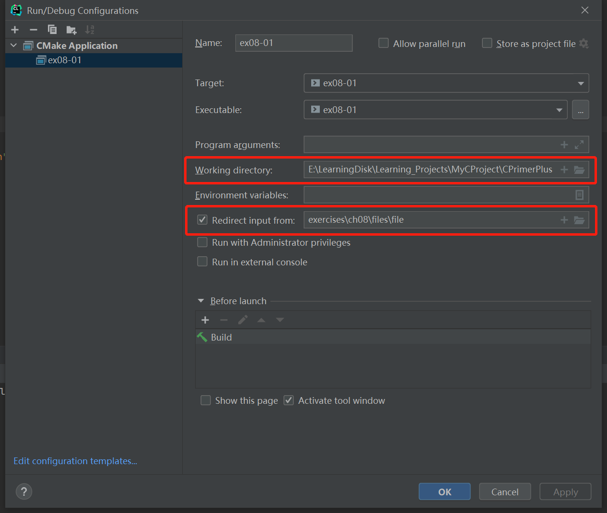

# 习题8.1

&emsp;&emsp;设计一个程序，统计在读到文件结尾之前读取的字符数。

**解答：**  
代码位置：`exercises/ch08/ex01.c`
```c
#include <stdio.h>

int main(void) {
    int ch;
    // 字符数
    int count = 0;

    // 读取文件输入流，配置Redirect input from：exercises\ch08\files\file
    while ((ch = getchar()) != '&') {
        count++;
    }
    // 打印字符总数
    printf("%d characters read.\n", count);
    return 0;
}
```

该程序需要配置重定向文件，具体配置信息见下图：



文件`exercises/ch08/files/file`的内容：

```
Ishphat the robot
slid open the hatch
and shouted his challenge.&
```

**执行结果：**  

```
CPrimerPlus\cmake-build-debug-mingw\ex08-01.exe
64 characters read.

Process finished with exit code 0
```

