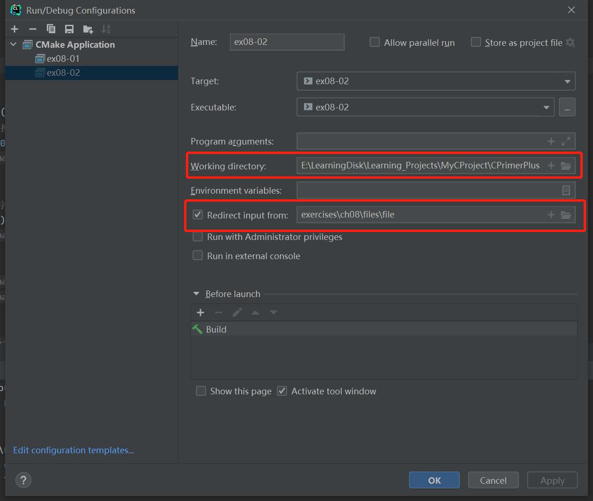

# 习题8.2

&emsp;&emsp;编写一个程序，在遇到`EOF`之前，把输入作为字符流读取。程序要打印每个输入的字符及其相应的ASCII十进制值。注意，在ASCII序列总，空格字符前面的字符都是非打印字符，要特殊处理这些字符。如果非打印字符是换行符或制表符，则分别打印`\n`或`\t`。否则，使用控制字符表示法。例如，ASCII的`1`是`Ctrl+A`，可显示为`^A`。注意，`A`的ASCII值是`Ctrl+A`的值加上64。其他非打印字符也有类似的关系。除每次遇到换行符打印新的一行之外，每行打印10对值。（注意：不同的操作系统其控制字符可能不同。）

**解答：**  
代码位置：`exercises/ch08/ex02.c`
```c
#include <stdio.h>

int main(void) {
    int ch;
    // 字符数
    int count = 0;

    while ((ch = getchar()) != '&') {
        // 当满10个，则打印换行符
        if (count++ == 10) {
            printf("\n");
            count = 1;
        }
        // 大于空格字符显示字符和相应的ASCII码
        if (ch >= '\040') {
            printf("%2c-%3d ", ch, ch);
        } else if (ch == '\t') {
            // 处理制表符
            printf("\\t-%3d", ch);
            printf(" ");
        } else if (ch == '\n') {
            // 处理换行符
            printf("\\n-%3d\n", ch);
            count = 0;
        } else {
            // 处理其他的非打印字符
            printf("^%c-%3d", ch, (ch + 64));
        }
    }

    return 0;
}
```

该程序需要配置重定向文件，具体配置信息见下图：



文件`exercises/ch08/files/file`的内容：

```
Ishphat the robot
slid open the hatch
and shouted his challenge.&
```

**执行结果：**
```
CPrimerPlus\cmake-build-debug-mingw\ex08-02.exe
 I- 73  s-115  h-104  p-112  h-104  a- 97  t-116   - 32  t-116  h-104 
 e-101   - 32  r-114  o-111  b- 98  o-111  t-116 \n- 10
 s-115  l-108  i-105  d-100   - 32  o-111  p-112  e-101  n-110   - 32 
 t-116  h-104  e-101   - 32  h-104  a- 97  t-116  c- 99  h-104 \n- 10
 a- 97  n-110  d-100   - 32  s-115  h-104  o-111  u-117  t-116  e-101 
 d-100   - 32  h-104  i-105  s-115   - 32  c- 99  h-104  a- 97  l-108 
 l-108  e-101  n-110  g-103  e-101  .- 46 
Process finished with exit code 0
```