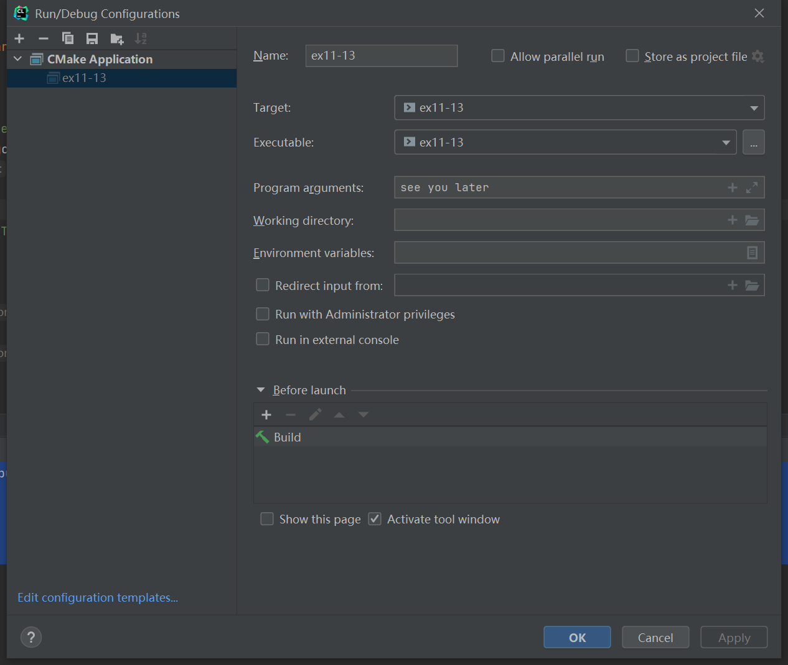

# 习题11.13

&emsp;&emsp;编写一个程序，反序显示命令行参数的单词。例如，命令行参数是`see you later`，该程序应打印`later you see`。

**解答：**  
代码位置：`exercises/ch11/ex13.c`
```c
#include <stdio.h>

int main(int argc, char **argv) {
    int i;

    // 打印命令行参数
    printf("The argument values:\n");
    for(i = 1; i < argc; i++) {
        printf("%s ", argv[i]);
    }

    printf("\nThe reserve arguments values:\n");
    // 根据输入的参数个数，反向打印每个命令行参数
    for (i = argc - 1; i > 0; i--) {
        if (i == 0) {
            printf("\n");
        } else {
            printf("%s ", argv[i]);
        }

    }
    return 0;
}
```

该程序需要配置命令行参数，具体配置信息见下图：


**执行结果：**
```
CPrimerPlus\cmake-build-debug-mingw\ex11-13.exe see you later
The argument values:
see you later
The reserve arguments values:
later you see
Process finished with exit code 0
```