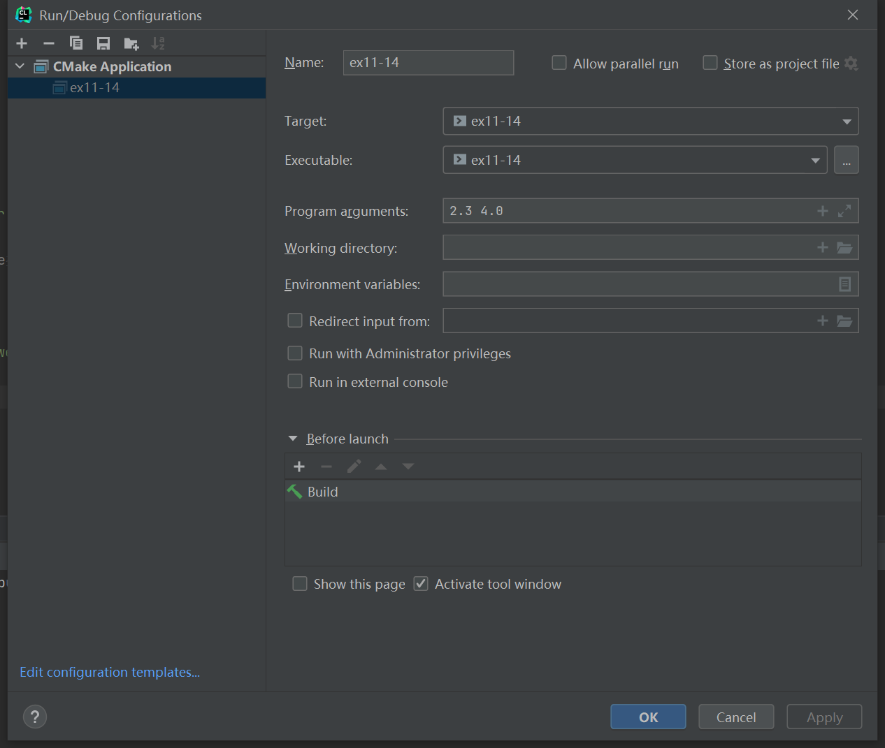

# 习题11.14

&emsp;&emsp;编写一个通过命令行运行的程序计算幂。第1个命令行参数是`double`类型的数，作为幂的底数，第2个参数是整数，作为幂的指数。

**解答：**  
代码位置：`exercises/ch11/ex14.c`
```c
#include <stdio.h>
#include <stdlib.h>
#include <math.h>

int main(int argc, char *argv[]) {
    double num, exp;

    if (argc != 3) {
        // 提示命令用法
        printf("Usage: %s number exponent\n", argv[0]);
    } else {
        // 使用atof函数将命令行参数转为double类型的数
        num = atof(argv[1]);
        exp = atof(argv[2]);
        // 打印幂的结果
        printf("%g to the %g power = %g\n", num, exp, pow(num, exp));
    }

    return 0;
}
```

该程序需要配置命令行参数，具体配置信息见下图：

**执行结果：**
```
CPrimerPlus\cmake-build-debug-mingw\ex11-14.exe 2.3 4.0
2.3 to the 4 power = 27.9841

Process finished with exit code 0
```