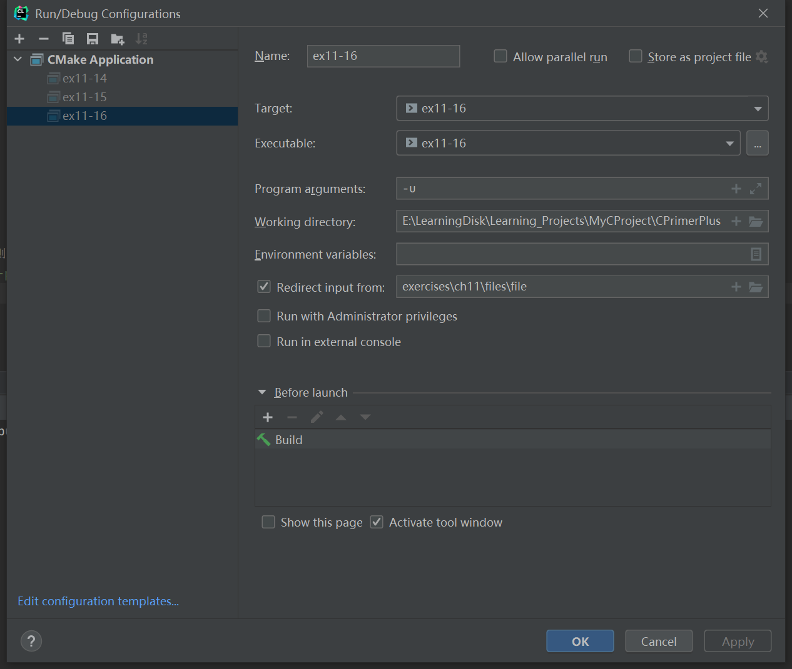
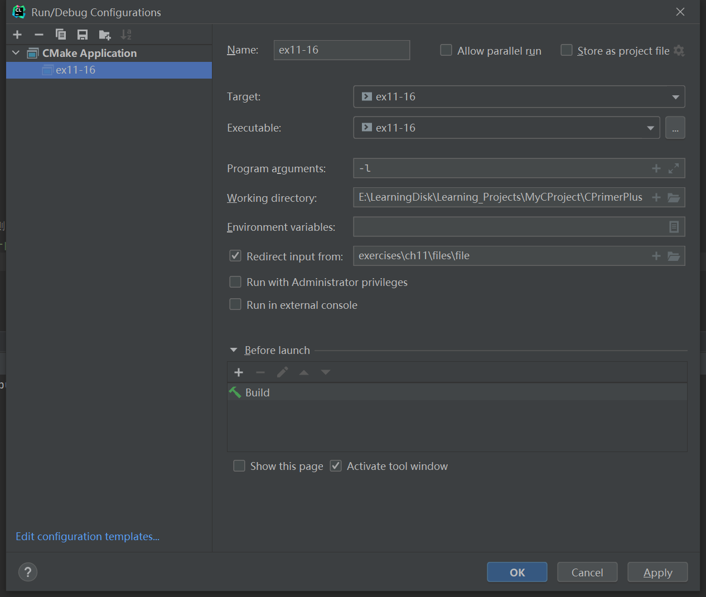

# 习题11.16

&emsp;&emsp;编写一个程序读取输入，直至读到文件结尾，然后把字符串打印出来。该程序识别和实现下面的命令行参数：  
`-p` 按原样打印  
`-u` 把输入全部转换成大写  
`-l` 把输入全部转换成小写  
如果没有命令行参数，则让程序像是使用了`-p`参数那样运行。

**解答：**  
代码位置：`exercises/ch11/ex16.c`
```c
#include <stdio.h>
#include <stdbool.h>
#include <ctype.h>

int main(int argc, char *argv[]) {
    // 默认模式是p
    char mode = 'p';
    bool ok = true;
    int ch;

    if (argc == 2) {
        if (argv[1][0] != '-') {
            // 如果第1个命令行参数不是-x型，则提示用户命令行用法
            printf("Usage: %s [-p | -u | -l]\n", argv[0]);
            ok = false;
        } else {
            switch (argv[1][1]) {
                case 'p':
                case 'u':
                case 'l':
                    // 读取模式
                    mode = argv[1][1];
                    break;
                default:
                    printf("%s invalid parameter; ", argv[1]);
                    printf("using default parameter p.\n");
            }
        }
    }

    if (ok) {
        while ((ch = getchar()) != EOF) {
            // 根据不同的模式，执行操作
            switch (mode) {
                case 'p':
                    // 按原样打印
                    putchar(ch);
                    break;
                case 'u':
                    // 把输入全部转换成大写
                    putchar(toupper(ch));
                    break;
                case 'l':
                    // 把输入全部转换成小写
                    putchar(tolower(ch));
                default:;
            }
        }
    }
    return 0;
}
```

文件`exercises/ch11/files/file`的内容：
```
Ishphat the robot
slid open the hatch
and shouted his challenge.&
```

**执行结果：**
该程序需要配置命令行参数，各个模式的具体配置信息如下：
1. `-p`模式：按原样打印

```
CPrimerPlus\cmake-build-debug-mingw\ex11-16.exe -p
Ishphat the robot
slid open the hatch
and shouted his challenge.&
Process finished with exit code 0
```

2. `-u`模式：把输入全部转换成大写

```
CPrimerPlus\cmake-build-debug-mingw\ex11-16.exe -u
ISHPHAT THE ROBOT
SLID OPEN THE HATCH
AND SHOUTED HIS CHALLENGE.&
Process finished with exit code 0
```

3. `-l`模式：把输入全部转换成大写

```
CPrimerPlus\cmake-build-debug-mingw\ex11-16.exe -l
ishphat the robot
slid open the hatch
and shouted his challenge.&
Process finished with exit code 0
```