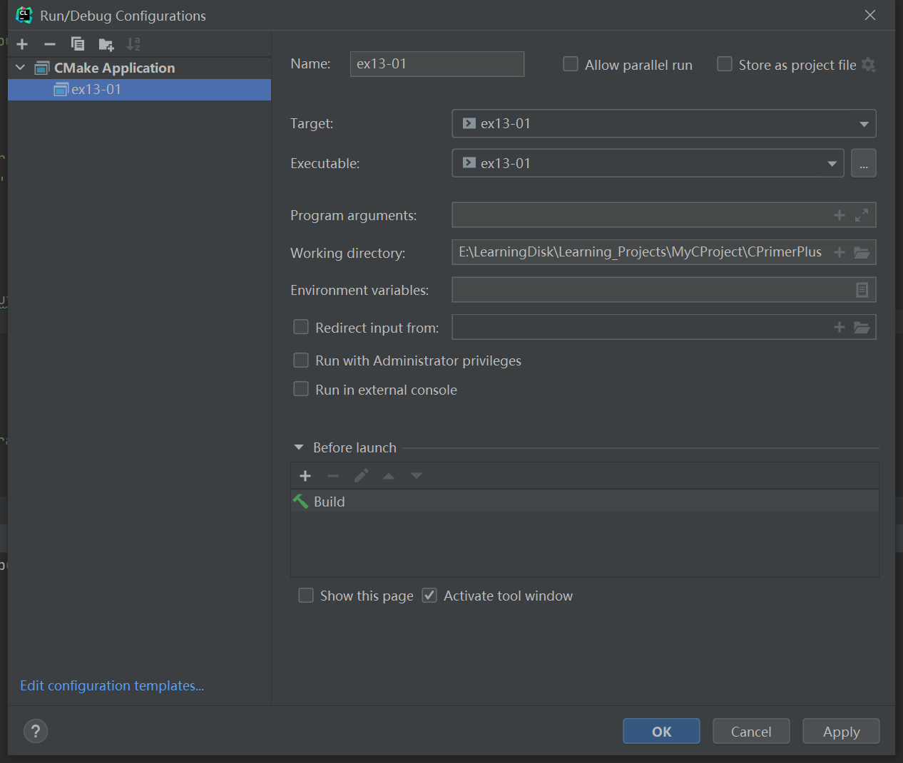

# 习题13.1

&emsp;&emsp;修改程序清单13.1中的程序，要求提示用户输入文件名，并读取用户输入的信息，不使用命令行参数。

**解答：**  
代码位置：`exercises/ch13/ex01.c`
```c
#include <stdio.h>
#include <stdlib.h> // exit() prototype

#define LEN 81

char *s_gets(char *st, int n);

int main(void) {
    int ch;         // place to store each character as read
    FILE *fp;       // "file pointer"
    unsigned long count = 0;
    char file_name[LEN];

    // 提示用户输入文件名
    printf("Enter a file name you want:\n");
    // input exercises/ch13/files/eddy
    s_gets(file_name, LEN);

    // 当文件读取失败，退出程序
    if ((fp = fopen(file_name, "r")) == NULL) {
        printf("Can't open %s\n", file_name);
        exit(EXIT_FAILURE);
    }
    // 显示文件内容
    printf("\nFile Context:\n");
    while ((ch = getc(fp)) != EOF) {
        putc(ch, stdout);  // same as putchar(ch);
        count++;
    }
    // 关闭文件流
    fclose(fp);
    // 显示读取的字符数
    printf("\nFile %s has %lu characters.\n", file_name, count);

    return 0;
}

char *s_gets(char *st, int n) {
    char *ret_val;
    int i = 0;

    ret_val = fgets(st, n, stdin);
    if (ret_val) {
        while (st[i] != '\n' && st[i] != '\0')
            i++;
        if (st[i] == '\n')
            st[i] = '\0';
        else // must have words[i] == '\0'
            while (getchar() != '\n')
                continue;
    }
    return ret_val;
}
```

该程序需要配置工作目录，用于读取文件相对路径，具体配置信息见下图：


**执行结果：**
```
CPrimerPlus\cmake-build-debug-mingw\ex13-01.exe
Enter a file name you want:
exercises/ch13/files/eddy

File Context:
So even Eddy came oven ready.

File exercises/ch13/files/eddy has 30 characters.

Process finished with exit code 0
```
