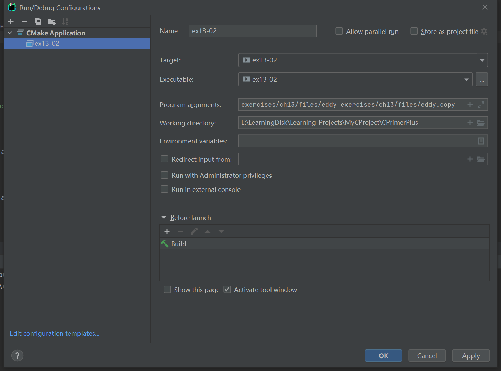

# 习题13.2

&emsp;&emsp;编写一个文件拷贝程序，该程序通过命令行获取原始文件名和拷贝文件名。尽量使用标准I/O和二进制模式。

**解答：**  
代码位置：`exercises/ch13/ex02.c`

```c
#include <stdio.h>
#include <stdlib.h>

int main(int argc, char *argv[]) {
    int byte;
    FILE * source_file;
    FILE * target_file;

    if (argc != 3) {
        // 提示用户命令的用法
        printf("Usage: %s source_file target_file\n", argv[0]);
        exit(EXIT_FAILURE);
    }

    // 检查文件是否能正常打开，并获取文件句柄
    if ((source_file = fopen(argv[1], "rb")) == NULL) {
        printf("Could not open file %s for input\n", argv[1]);
        exit(EXIT_FAILURE);
    }
    if ((target_file = fopen(argv[2], "wb")) == NULL) {
        printf("Could not open file %s for output\n", argv[2]);
        exit(EXIT_FAILURE);
    }

    printf("Copying the file......\n");
    // 拷贝文件
    while ((byte = getc(source_file)) != EOF) {
        // 写入文件
        putc(byte, target_file);
    }
    printf("Complete the file copy from file %s to file %s\n", argv[1], argv[2]);

    // 检查文件是否能正常关闭，并关闭文件
    if (fclose(source_file) != 0)
        printf("Could not close file %s\n", argv[1]);
    if (fclose(target_file) != 0)
        printf("Could not close file %s\n", argv[2]);

    return 0;
}
```

该程序需要配置命令行参数和工作目录，用于读取文件相对路径，具体配置信息见下图：


**执行结果：**

```
CPrimerPlus\cmake-build-debug-mingw\ex13-02.exe exercises/ch13/files/eddy exercises/ch13/files/eddy.copy
Copying the file......
Complete the file copy from file exercises/ch13/files/eddy to file exercises/ch13/files/eddy.copy

Process finished with exit code 0
```

原文件`eddy`内容：
```
So even Eddy came oven ready.
```
拷贝文件`eddy.copy`内容：
```
So even Eddy came oven ready.
```