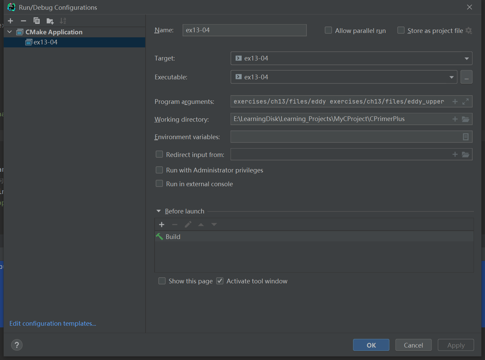

# 习题13.4

&emsp;&emsp;编写一个程序，按顺序在屏幕上显示命令行中列出的所有文件。使用`argc`控制循环。

**解答：**  
代码位置：`exercises/ch13/ex04.c`

```c
#include <stdio.h>
#include <stdlib.h>

int main(int argc, char * argv[]) {
    int byte;
    FILE * source;
    int file_index;

    if (argc == 1) {
        // 提示用户命令的用法
        printf("Usage: %s filename[s]\n", argv[0]);
        exit(EXIT_FAILURE);
    }

    // 循环打印文件内容
    for (file_index = 1; file_index < argc; file_index++) {
        // 检查文件是否能正常打开，并获取文件句柄
        if ((source = fopen(argv[file_index], "r")) == NULL) {
            printf("Could not open file %s for input\n", argv[file_index]);
            continue;
        }
        // 打印文件内容
        printf("%s file content:\n", argv[file_index]);
        while ((byte = getc(source)) != EOF) {
            putchar(byte);
        }
        // 检查文件是否能正常关闭，并关闭文件
        if (fclose(source) != 0) {
            printf("Could not close file %s\n", argv[file_index]);
        }
    }

    return 0;
}
```

该程序需要配置命令行参数和工作目录，用于读取文件相对路径，具体配置信息见下图：


**执行结果：**
```
CPrimerPlus\cmake-build-debug-mingw\ex13-04.exe exercises/ch13/files/eddy exercises/ch13/files/eddy_upper
exercises/ch13/files/eddy file content:
So even Eddy came oven ready.
exercises/ch13/files/eddy_upper file content:
SO EVEN EDDY CAME OVEN READY.

Process finished with exit code 0
```