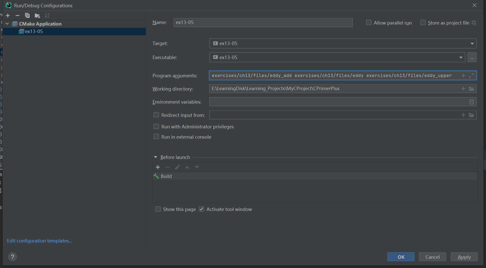

# 习题13.5

&emsp;&emsp;修改程序清单13.5中的程序，用命令行界面代替交互式界面。

**解答：**  
代码位置：`exercises/ch13/ex05.c`
```c
#include <stdio.h>
#include <stdlib.h>
#include <string.h>

#define BUFSIZE 4096

void append(FILE *source, FILE *dest);

char *s_gets(char *st, int n);

// ex05 exercises/ch13/files/eddy_add exercises/ch13/files/eddy exercises/ch13/files/eddy_upper
int main(int argc, char *argv[]) {
    FILE *fa, *fs;    // fa for append file, fs for source file
    int files = 0;  // number of files appended
    int fct;

    if (argc < 3) {
        // 提示用户命令的用法
        printf("Usage: %s append_file source_file[s]\n", argv[0]);
        exit(EXIT_FAILURE);
    }

    // 检查文件是否能正常打开，并获取文件句柄
    if ((fa = fopen(argv[1], "a+")) == NULL) {
        fprintf(stderr, "Can't open %s\n", argv[1]);
        exit(EXIT_FAILURE);
    }
    // 检查输入的缓存区
    if (setvbuf(fa, NULL, _IOFBF, BUFSIZE) != 0) {
        fputs("Can't create output buffer\n", stderr);
        exit(EXIT_FAILURE);
    }

    for (fct = 2; fct < argc; fct++) {
        // 检查文件，不能添加自己
        if (strcmp(argv[fct], argv[1]) == 0)
            fputs("Can't append file to itself\n", stderr);
        else if ((fs = fopen(argv[fct], "r")) == NULL)
            // 检查文件是否能正常打开，并获取文件句柄
            fprintf(stderr, "Can't open %s\n", argv[fct]);
        else {
            // 检查是否能创建输入缓冲区
            if (setvbuf(fs, NULL, _IOFBF, BUFSIZE) != 0) {
                fputs("Can't create input buffer\n", stderr);
                continue;
            }
            // 添加文件内容
            append(fs, fa);
            if (ferror(fs) != 0)
                fprintf(stderr, "Error in reading file %s.\n",
                        argv[fct]);
            if (ferror(fa) != 0)
                fprintf(stderr, "Error in writing file %s.\n",
                        argv[1]);
            // 关闭文件
            fclose(fs);
            files++;
            printf("File %s appended.\n", argv[fct]);
        }
    }
    printf("Done. %d files appended.\n", files);
    fclose(fa);

    return 0;
}

void append(FILE *source, FILE *dest) {
    size_t bytes;
    static char temp[BUFSIZE]; // allocate once

    while ((bytes = fread(temp, sizeof(char), BUFSIZE, source)) > 0)
        // 从输入缓冲区中追加文件内容到目标文件
        fwrite(temp, sizeof(char), bytes, dest);
}
```

该程序需要配置命令行参数和工作目录，用于读取文件相对路径，具体配置信息见下图：


**执行结果：**
```
CPrimerPlus\cmake-build-debug-mingw\ex13-05.exe exercises/ch13/files/eddy_add exercises/ch13/files/eddy exercises/ch13/files/eddy_upper
File exercises/ch13/files/eddy appended.
File exercises/ch13/files/eddy_upper appended.
Done. 2 files appended.

Process finished with exit code 0
```

原文件`eddy`内容：
```
So even Eddy came oven ready.
```
原文件`eddy_upper`内容：
```
SO EVEN EDDY CAME OVEN READY.
```
目标文件`eddy_add`内容：
```
So even Eddy came oven ready.
SO EVEN EDDY CAME OVEN READY.
```