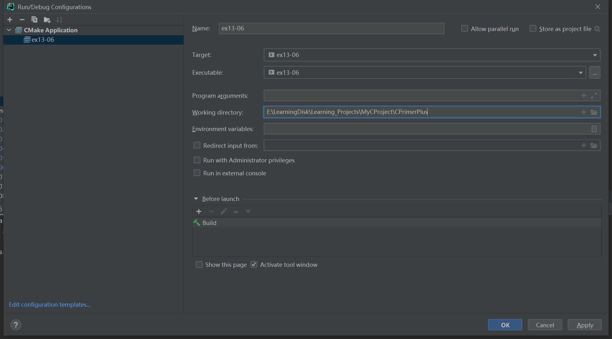

# 习题13.6

&emsp;&emsp;使用命令行参数的程序依赖于用户的内存如何正确地使用它们。重写程序清单13.2中的程序，不使用命令行参数，而是提示用户输入所需信息。

**解答：**  
代码位置：`exercises/ch13/ex06.c`
```c
#include <stdio.h>
#include <stdlib.h>
#include <string.h>

#define LEN 40
char *s_gets(char *st, int n);

int main(void) {
    FILE *in, *out;
    int ch;
    char input_file_name[LEN];
    char output_file_name[LEN];
    int count = 0;

    // 提示用户输入原文件
    printf("Enter a source file name:\n");
    s_gets(input_file_name, LEN);
    // 检查原文件是否能正常打开，并获取文件句柄
    if ((in = fopen(input_file_name, "r")) == NULL) {
        fprintf(stderr, "I couldn't open the file \"%s\"\n",
                input_file_name);
        exit(EXIT_FAILURE);
    }

    strncpy(output_file_name, input_file_name, LEN - 5);
    // 重命名目标文件
    output_file_name[LEN - 5] = '\0';
    strcat(output_file_name, ".red");
    // 检查目标文件是否能正常打开，并获取文件句柄
    if ((out = fopen(output_file_name, "w")) == NULL) {
        fprintf(stderr, "Can't create output file.\n");
        exit(3);
    }
    // 拷贝数组
    while ((ch = getc(in)) != EOF) {
        // 打印第三个字符
        if (count++ % 3 == 0) {
            putc(ch, out);
        }
    }
    printf("Complete the file copy from file %s to file %s\n", input_file_name, output_file_name);

    // 关闭文件
    if (fclose(in) != 0 || fclose(out) != 0)
        fprintf(stderr, "Error in closing files\n");

    return 0;
}

char *s_gets(char *st, int n) {
    char *ret_val;
    int i = 0;

    ret_val = fgets(st, n, stdin);
    if (ret_val) {
        while (st[i] != '\n' && st[i] != '\0')
            i++;
        if (st[i] == '\n')
            st[i] = '\0';
        else // must have words[i] == '\0'
        while (getchar() != '\n')
            continue;
    }
    return ret_val;
}
```

该程序需要配置工作目录，用于读取文件相对路径，具体配置信息见下图：


**执行结果：**
```
CPrimerPlus\cmake-build-debug-mingw\ex13-06.exe
Enter a source file name:
exercises/ch13/files/eddy
Complete the file copy from file exercises/ch13/files/eddy to file exercises/ch13/files/eddy.red

Process finished with exit code 0
```

原文件`eddy`内容：
```
So even Eddy came oven ready.
```
目标文件`eddy.red`内容：
```
Send money
```