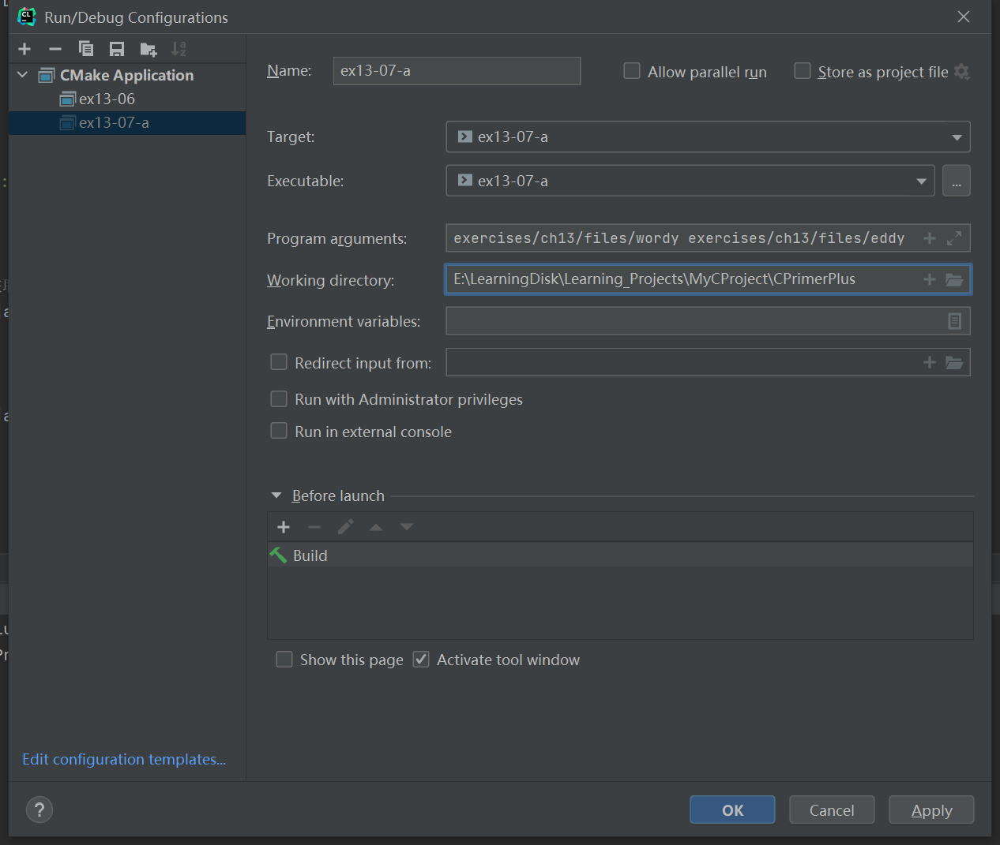
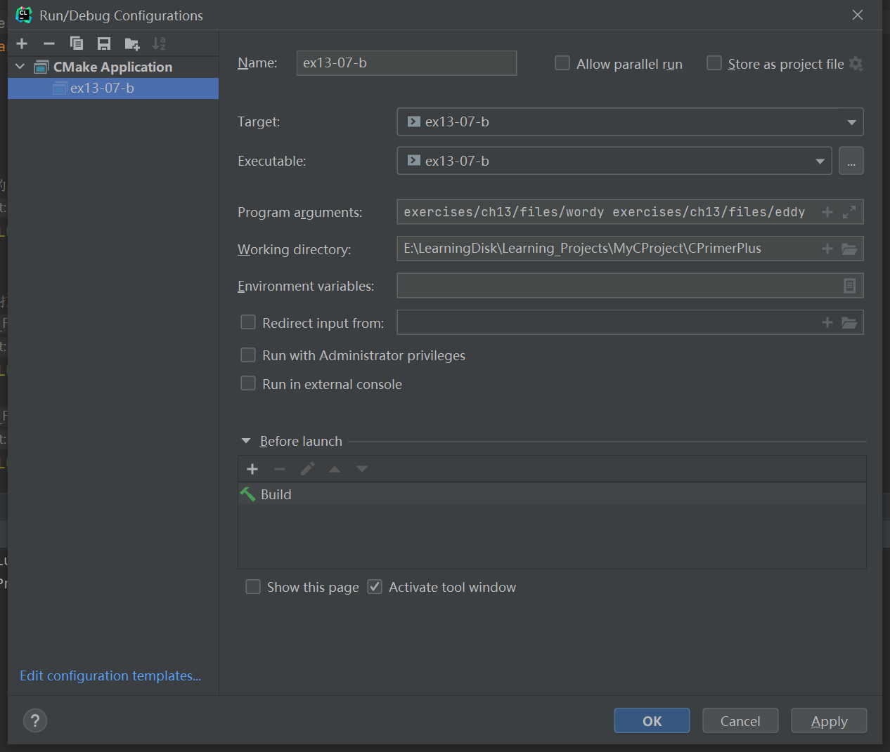

# 习题13.7

&emsp;&emsp;编写一个程序打开两个文件。可以使用命令行参数或提示用户输入文件名。  
a. 该程序以这样的顺序打印：打印第1个文件的第1行，第2个文件的第1行，第1个文件的第2行，第2个文件的第2行，以此类推，打印到行数较多文件的最后一行。  
b. 修改该程序，把行号相同的行打印成一行。

**解答：**  
1. 按照顺序打印文件内容  
代码位置`exercises/ch13/ex07-a.c`
```c
#include <stdio.h>
#include <stdlib.h>

int main(int argc, char *argv[]) {
    FILE * f1;
    FILE * f2;
    char ch1, ch2;

    if (argc != 3){
        // 提示用户命令的用法
        printf("Usage: %s file1 file2\n", argv[0]);
        exit(EXIT_FAILURE);
    }

    // 检查文件是否能正常打开，并获取文件句柄
    if ((f1 = fopen(argv[1], "r")) == NULL) {
        printf("Could not open file %s for input\n", argv[1]);
        exit(EXIT_FAILURE);
    }
    if ((f2 = fopen(argv[2], "r")) == NULL) {
        printf("Could not open file %s for input\n", argv[2]);
        exit(EXIT_FAILURE);
    }

    // 获取文件的第一个字符
    ch1 = getc(f1);
    ch2 = getc(f2);

    while (ch1 != EOF || ch2 != EOF) {
        // 打印第1个文件的一行
        while (ch1 != EOF && ch1 != '\n') {
            putchar(ch1);
            ch1 = getc(f1);
        }
        if (ch1 != EOF) {
            putchar('\n');
            ch1 = getc(f1);
        }

        // 打印第2个文件的一行
        while (ch2 != EOF && ch2 != '\n') {
            putchar(ch2);
            ch2 = getc(f2);
        }
        if (ch2 != EOF) {
            putchar('\n');
            ch2 = getc(f2);
        }
    }

    // 检查文件是否能正常关闭，并关闭文件
    if (fclose(f1) != 0)
        printf("Could not close file %s\n", argv[1]);
    if (fclose(f2) != 0)
        printf("Could not close file %s\n", argv[2]);

    return 0;
}
```
该程序需要配置命令行参数和工作目录，用于读取文件相对路径，具体配置信息见下图：


执行结果：
```
CPrimerPlus\cmake-build-debug-mingw\ex13-07-a.exe exercises/ch13/files/wordy exercises/ch13/files/eddy
The
So even Eddy came oven ready.
fabulous
programmer
enchanted
the
large

Process finished with exit code 0
```

2. 把行号相同的行打印成一行  
代码位置`exercises/ch13/ex07-b.c`
```c
#include <stdio.h>
#include <stdlib.h>

int main(int argc, char *argv[]) {
    FILE * f1;
    FILE * f2;
    char ch1, ch2;

    if (argc != 3){
        // 提示用户命令的用法
        printf("Usage: %s file1 file2\n", argv[0]);
        exit(EXIT_FAILURE);
    }

    // 检查文件是否能正常打开，并获取文件句柄
    if ((f1 = fopen(argv[1], "r")) == NULL) {
        printf("Could not open file %s for input\n", argv[1]);
        exit(EXIT_FAILURE);
    }
    if ((f2 = fopen(argv[2], "r")) == NULL) {
        printf("Could not open file %s for input\n", argv[2]);
        exit(EXIT_FAILURE);
    }

    // 获取文件的第一个字符
    ch1 = getc(f1);
    ch2 = getc(f2);

    while (ch1 != EOF || ch2 != EOF) {
        // 打印第1个文件的一行
        while (ch1 != EOF && ch1 != '\n') {
            putchar(ch1);
            ch1 = getc(f1);
        }
        if (ch1 != EOF) {
            if (ch2 == EOF)
                putchar('\n');
            else
                putchar(' ');
            ch1 = getc(f1);
        }

        // 打印第2个文件的一行
        while (ch2 != EOF && ch2 != '\n') {
            putchar(ch2);
            ch2 = getc(f2);
        }
        if (ch2 != EOF) {
            putchar('\n');
            ch2 = getc(f2);
        }
    }

    // 检查文件是否能正常关闭，并关闭文件
    if (fclose(f1) != 0)
        printf("Could not close file %s\n", argv[1]);
    if (fclose(f2) != 0)
        printf("Could not close file %s\n", argv[2]);

    return 0;
}
```



执行结果：
```
CPrimerPlus\cmake-build-debug-mingw\ex13-07-b.exe exercises/ch13/files/wordy exercises/ch13/files/eddy
The So even Eddy came oven ready.
fabulous
programmer
enchanted
the
large

Process finished with exit code 0
```