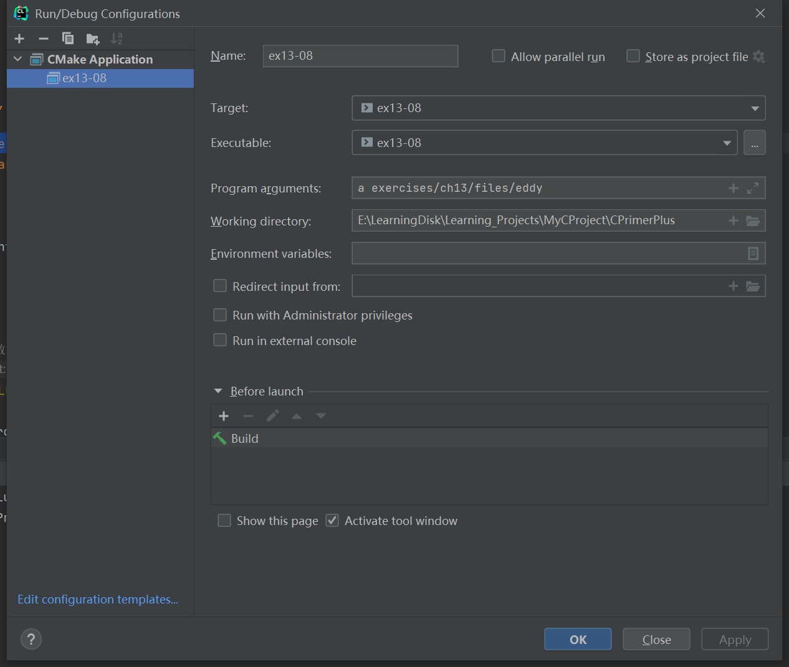

# 习题13.8

&emsp;&emsp;编写一个程序，以一个字符和任意文件名作为命令行参数。如果字符后面没有参数，该程序读取标准输入；否则，程序依次打开每个文件并报告每个文件中该字符出现的次数。文件名和字符本身也要一同报告。程序应包含错误检查，以确定参数数量是否正确和是否能打开文件。如果无法打开文件，程序应报告这一情况，然后继续处理下一个文件。

**解答：**  
代码位置：`exercises/ch13/ex08.c`
```c
#include <stdio.h>
#include <stdlib.h>
#include <string.h>

#define LEN 81

char *s_gets(char *st, int n);

int main(int argc, char *argv[]) {
    char find_ch;
    char ch;
    FILE *fp;
    unsigned long count = 0;
    char input[LEN];


    if (argc < 2) {
        // 检查命令行参数，显示命令用法
        printf("Usage: %s <character> [file_name1 ....]", argv[0]);
        exit(EXIT_FAILURE);
    }
    if (strlen(argv[1]) == 1) {
        // 记录字符
        find_ch = argv[1][0];
    } else {
        printf("Usage: %s <character> [file_name1 ....]", argv[0]);
        exit(EXIT_FAILURE);
    }

    if (argc == 2) {
        // 如果没有参数，读取标准输入
        printf("Enter the string you wanted to analysize: ");
        s_gets(input, LEN);
        int input_length = strlen(input);
        for (int i = 0; i < input_length; i++) {
            // 进行字符比较
            if (find_ch == input[i]) {
                // 统计字符出现的次数
                count++;
            }
        }
        // 打印结果
        printf("In string \"%s\", character %c have appeared %d times\n", input, find_ch, count);
    } else {
        for (int i = 2; i < argc; i++) {
            count = 0;
            // 依次检查是否能正常打开文件，获取文件句柄
            if ((fp = fopen(argv[i], "r")) == NULL) {
                printf("Could not open file %s for input\n", argv[i]);
                continue;
            }
            // 统计字符出现的次数
            while ((ch = fgetc(fp)) != EOF) {
                if (find_ch == ch)
                    count++;
            }
            // 检查文件是否正常关闭
            if (fclose(fp) != 0) {
                printf("Could not close file %s\n", argv[i]);
            }
            // 打印结果
            printf("In file %s, character %c have appeared %lu times\n", argv[i], find_ch, count);
        }
    }

    return 0;
}

char *s_gets(char *st, int n) {
    char *ret_val;
    int i = 0;

    ret_val = fgets(st, n, stdin);
    if (ret_val) {
        while (st[i] != '\n' && st[i] != '\0')
            i++;
        if (st[i] == '\n')
            st[i] = '\0';
        else // must have words[i] == '\0'
            while (getchar() != '\n')
                continue;
    }
    return ret_val;
}
```

该程序需要配置命令行参数和工作目录，用于读取文件相对路径，具体配置信息见下图：


文件`eddy`内容：
```
So even Eddy came oven ready.
```

**执行结果：**
```
CPrimerPlus\cmake-build-debug-mingw\ex13-08.exe a exercises/ch13/files/eddy
In file exercises/ch13/files/eddy, character a have appeared 2 times

Process finished with exit code 0
```