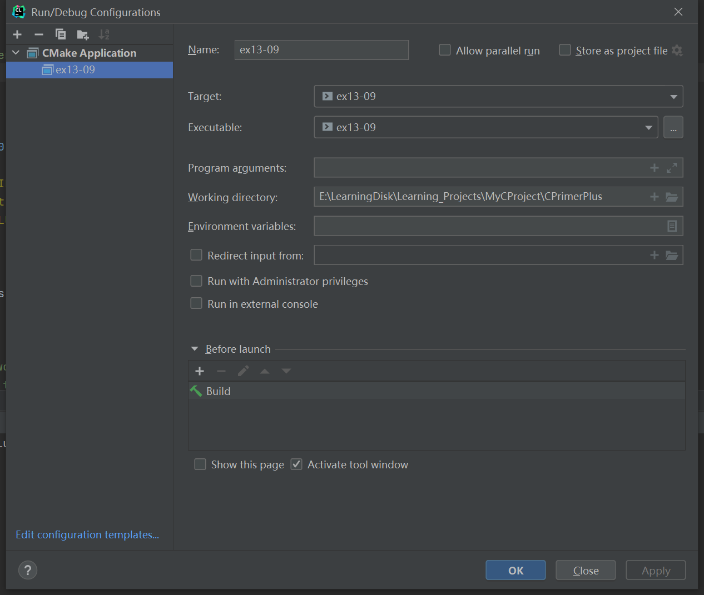

# 习题13.9

&emsp;&emsp;修改程序清单13.3中的程序，从1开始，根据加入列表的顺序为每个单词编号。当程序下次运行时，确保新的单词编号接着上次的编号开始。

**解答：**  
代码位置：`exercises/ch13/ex09.c`
```c
#include <stdio.h>
#include <stdlib.h>

#define MAX 47
#define FILE_NAME "exercises/ch13/files/wordy"

int main(void) {
    FILE *fp;
    char words[MAX];
    int word_count = 0;

    // 检查文件是否能正常打开，并获取文件句柄
    if ((fp = fopen(FILE_NAME, "a+")) == NULL) {
        fprintf(stdout, "Can't open \"wordy\" file.\n");
        exit(EXIT_FAILURE);
    }

    // 将文件定位到文件开始
    rewind(fp);
    while (fgets(words, MAX, fp) != NULL)
        // 统计单词总个数
        word_count++;
    // 再次将文件定位到文件开始
    rewind(fp);

    // 提示用户输入单词
    puts("Enter words to add to the file; press the #");
    puts("key at the beginning of a line to terminate.");
    while ((fscanf(stdin, "%40s", words) == 1) && (words[0] != '#'))
        // 将新的单词和编号按照格式添加到文件最后
        fprintf(fp, "%3d: %s\n", ++word_count, words);

    // 显示文件内容
    puts("File contents:");
    rewind(fp);
    while (fgets(words, MAX, fp) != NULL)
        fputs(words, stdout);

    // 检查文件是否能正常关闭，并关闭文件
    if (fclose(fp) != 0) {
        fprintf(stderr, "Error closing file\n");
    }
    puts("Done!");

    return 0;
}
```

该程序需要配置工作目录，用于读取文件相对路径，具体配置信息见下图：


文件`wordy`内容：
```
The
fabulous
programmer
enchanted
the
large
```

**执行结果：**
```
CPrimerPlus\cmake-build-debug-mingw\ex13-09.exe
Enter words to add to the file; press the #
key at the beginning of a line to terminate.
Hello
World
Relph
#
File contents:
The
fabulous
programmer
enchanted
the
large
  7: Hello
  8: World
  9: Relph#
Done!

Process finished with exit code 0
```

处理之后的文件`wordy`内容：
```
The
fabulous
programmer
enchanted
the
large
  7: Hello
  8: World
  9: Relph#
```