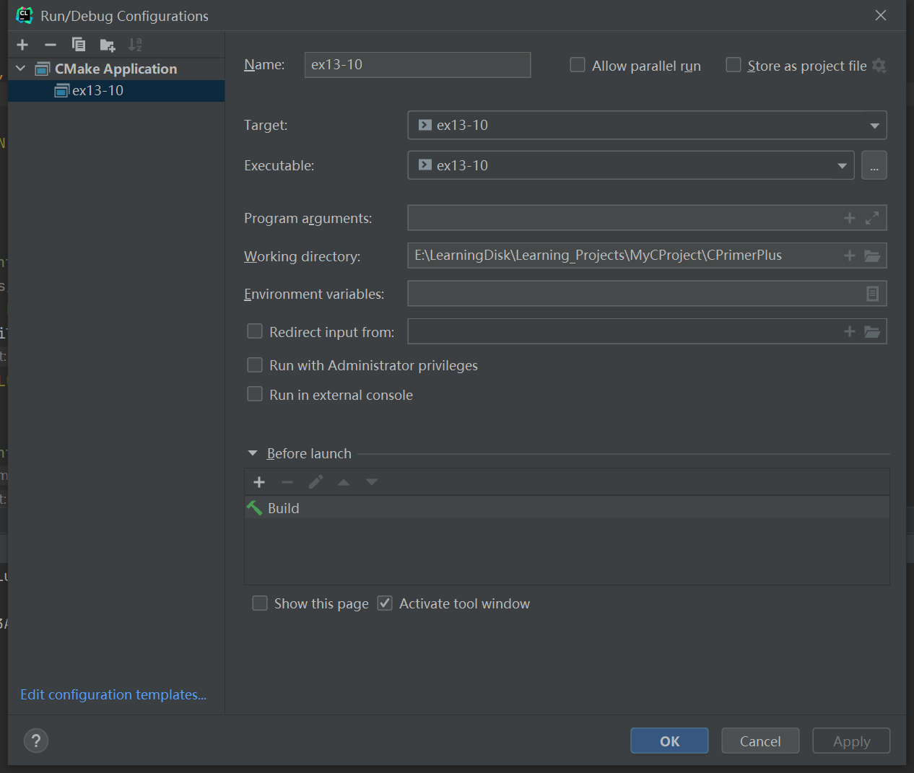

# 习题13.10

&emsp;&emsp;编写一个程序打开一个文本文件，通过交互方式获得文件名。通过一个循环，提示用户输入一个文件位置。然后该程序打印从该位置开始到洗一个换行符之前的内容。用户输入负数或非数值字符可以结束输入循环。

**解答：**  
代码位置：`exercises/ch13/ex10.c`
```c
#include <string.h>
#include <stdlib.h>
#include <stdio.h>

#define LEN 80
#define SIZE 256

char *s_gets(char *st, int n);

int main(void) {
    char file_name[LEN];
    FILE *fp;
    int num;
    char buffer[SIZE];

    // 提示用户输入文件名
    printf("Enter a file name:");
    s_gets(file_name, LEN);

    // 检查文件是否能正常打开，并获取文件句柄
    if ((fp = fopen(file_name, "r")) == NULL) {
        printf("Could not open file %s for input\n", file_name);
        exit(EXIT_FAILURE);
    }

    // 提示用户输入一个文件位置
    printf("Enter a number to seek file:");
    while (scanf("%d", &num) == 1 && num > 0) {
        printf("After %dth character, file content:\n", num);
        // 将文件句柄移动至这个位置
        fseek(fp, num - 1, SEEK_SET);
        // 打印下一个换行符之前的内容
        if (fgets(buffer, SIZE, fp) != NULL) {
            printf("%s", buffer);
        }
        printf("\nEnter next number to seek file (<0 to quit):");
    }

    // 检查文件是否能正常关闭，并关闭文件
    if (fclose(fp) != 0) {
        printf("Could not close file %s\n", file_name);
    }

    return 0;
}

char *s_gets(char *st, int n) {
    char *ret_val;
    char *find;

    ret_val = fgets(st, n, stdin);
    if (ret_val) {
        find = strchr(st, '\n');
        if (find)
            *find = '\0';
        else
            while (getchar() != '\n')
                continue;
    }
    return ret_val;
}
```

该程序需要配置工作目录，用于读取文件相对路径，具体配置信息见下图：


**执行结果：**
```
CPrimerPlus\cmake-build-debug-mingw\ex13-10.exe
Enter a file name:exercises/ch13/files/wordy
Enter a number to seek file:15
After 15th character, file content:
rogrammer

Enter next number to seek file (<0 to quit):18
After 18th character, file content:
rammer

Enter next number to seek file (<0 to quit):29
After 29th character, file content:
anted

Enter next number to seek file (<0 to quit):0

Process finished with exit code 0

```