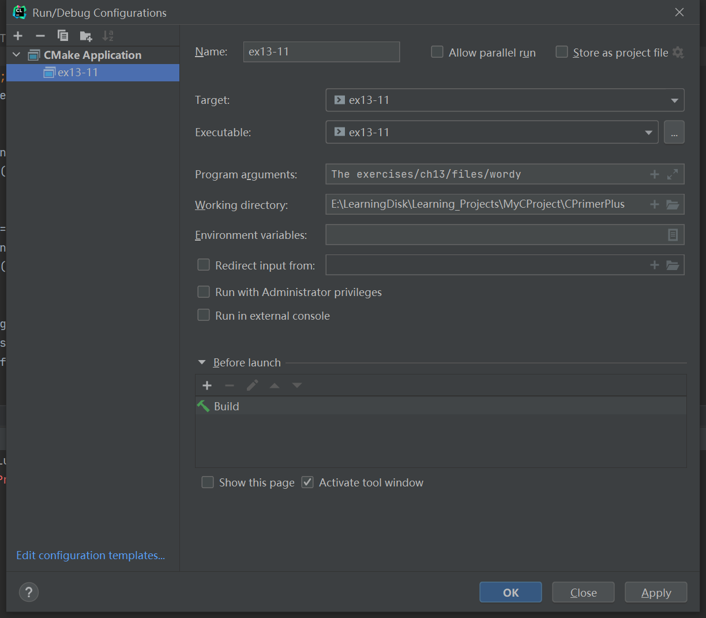

# 习题13.11

&emsp;&emsp;编写一个程序，接受两个命令行参数。第1个参数是一个字符串，第2个参数是一个文件名。然后该程序查找该文件，打印文件中包含该字符串的所有行。因为该任务是面向行而不是面向字符的，所以要使用`fgets()`而不是`getc()`。使用标准C库函数`strstr()`（11.5.7节介绍过）在每一行中查找指定字符串。假设文件中的所有行都不超过255个字符。

**解答：**  
代码位置：`exercises/ch13/ex11.c`
```c
#include <stdlib.h>
#include <string.h>
#include <stdio.h>

#define SLEN 256

int main(int argc, char *argv[]) {
    FILE *fp;
    char line_content[SLEN];

    if (argc != 3) {
        // 检查命令行参数，显示命令用法
        fprintf(stderr, "Usage: %s string filename\n", argv[0]);
        exit(EXIT_FAILURE);
    }

    // 检查是否能正常打开文件，获取文件句柄
    if ((fp = fopen(argv[2], "r")) == NULL) {
        fprintf(stderr, "Can not open file %s\n", argv[2]);
        exit(EXIT_FAILURE);
    }

    printf("The line contain \"%s\" in file %s:\n", argv[1], argv[2]);
    while (fgets(line_content, SLEN, fp) != NULL) {
        // 判断该行是否包含字符串
        if (strstr(line_content, argv[1]) != NULL)
            fputs(line_content, stdout);
    }

    // 检查文件是否正常关闭，并关闭该文件
    if (fclose(fp) != 0) {
        fprintf(stderr, "Could not close file %s\n", argv[1]);
    }

    return 0;
}
```

该程序需要配置命令行参数和工作目录，用于读取文件相对路径，具体配置信息见下图：


**执行结果：**
```
CPrimerPlus\cmake-build-debug-mingw\ex13-11.exe The exercises/ch13/files/wordy
The line contain "The" in file exercises/ch13/files/wordy:
The

Process finished with exit code 0
```