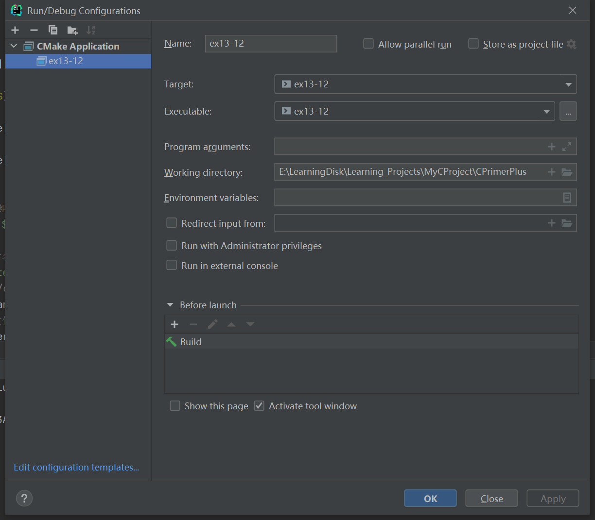

# 习题13.12

&emsp;&emsp;创建一个文本文件，内含20行，每行30个整数。这些整数都在0~9之间，用空格分开。该文件是用数字表示一张图片，0~9表示逐渐增加的灰度。编写一个程序，把文件中的内容读入一个$20 \times 30$的`int`数组中。一种把这些数字转换为图片的粗略方法是：该程序使用数组中的值初始化一个$20 \times 31$的字符数组，用值0对应空格字符，1对应点字符，以此类推。数字越大表示字符所占的空间越大。例如，用`#`表示9。每行的最后一个字符（第31个）是空字符，这样该数组包含了20个字符串。最后，程序显示最终的图片（即打印所有的字符串），并将结果存储在文本文件中。例如，下面是开始的数据：
```
0 0 9 0 0 0 0 0 0 0 0 0 5 8 9 9 8 5 2 0 0 0 0 0 0 0 0 0 0 0
0 0 0 0 9 0 0 0 0 0 0 0 5 8 9 9 8 5 5 2 0 0 0 0 0 0 0 0 0 0
0 0 0 0 0 0 0 0 0 0 0 0 5 8 1 9 8 5 4 5 2 0 0 0 0 0 0 0 0 0
0 0 0 0 9 0 0 0 0 0 0 0 5 8 9 9 8 5 0 4 5 2 0 0 0 0 0 0 0 0
0 0 9 0 0 0 0 0 0 0 0 0 5 8 9 9 8 5 0 0 4 5 2 0 0 0 0 0 0 0
0 0 0 0 0 0 0 0 0 0 0 0 5 8 9 1 8 5 0 0 0 4 5 2 0 0 0 0 0 0
0 0 0 0 0 0 0 0 0 0 0 0 5 8 9 9 8 5 0 0 0 0 4 5 2 0 0 0 0 0
5 5 5 5 5 5 5 5 5 5 5 5 5 8 9 9 8 5 5 5 5 5 5 5 5 5 5 5 5 5
8 8 8 8 8 8 8 8 8 8 8 8 5 8 9 9 8 5 8 8 8 8 8 8 8 8 8 8 8 8
9 9 9 9 0 9 9 9 9 9 9 9 9 9 9 9 9 9 9 9 9 9 3 9 9 9 9 9 9 9
8 8 8 8 8 8 8 8 8 8 8 8 5 8 9 9 8 5 8 8 8 8 8 8 8 8 8 8 8 8
5 5 5 5 5 5 5 5 5 5 5 5 5 8 9 9 8 5 5 5 5 5 5 5 5 5 5 5 5 5
0 0 0 0 0 0 0 0 0 0 0 0 5 8 9 9 8 5 0 0 0 0 0 0 0 0 0 0 0 0
0 0 0 0 0 0 0 0 0 0 0 0 5 8 9 9 8 5 0 0 0 0 6 6 0 0 0 0 0 0
0 0 0 0 2 2 0 0 0 0 0 0 5 8 9 9 8 5 0 0 5 6 0 0 6 5 0 0 0 0
0 0 0 0 3 3 0 0 0 0 0 0 5 8 9 9 8 5 0 5 6 1 1 1 1 6 5 0 0 0
0 0 0 0 4 4 0 0 0 0 0 0 5 8 9 9 8 5 0 0 5 6 0 0 6 5 0 0 0 0
0 0 0 0 5 5 0 0 0 0 0 0 5 8 9 9 8 5 0 0 0 0 6 6 0 0 0 0 0 0
0 0 0 0 0 0 0 0 0 0 0 0 5 8 9 9 8 5 0 0 0 0 0 0 0 0 0 0 0 0
0 0 0 0 0 0 0 0 0 0 0 0 5 8 9 9 8 5 0 0 0 0 0 0 0 0 0 0 0 0
```
根据以上描述选择特定的输出字符，最终输出如下：
```
  #         *%##%*'           
    #       *%##%**'          
            *%.#%*~*'         
    #       *%##%* ~*'        
  #         *%##%*  ~*'       
            *%#.%*   ~*'      
            *%##%*    ~*'     
*************%##%*************
%%%%%%%%%%%%*%##%*%%%%%%%%%%%%
#### #################:#######
%%%%%%%%%%%%*%##%*%%%%%%%%%%%%
*************%##%*************
            *%##%*            
            *%##%*    ==      
    ''      *%##%*  *=  =*    
    ::      *%##%* *=....=*   
    ~~      *%##%*  *=  =*    
    **      *%##%*    ==      
            *%##%*            
            *%##%*            
```

**解答：**  
代码位置：`exercises/ch13/ex12.c`
```c
#include <string.h>
#include <stdlib.h>
#include <stdio.h>

#define ROWS 20
#define COLS 30
#define LEVELS 10
#define LEN 81
// 数字对应字符
const char trans[LEVELS + 1] = " .':~*=&%#";
// 初始化图片
void init_pic(char pic[][COLS], char ch);

char *s_gets(char *st, int n);
// 转换图片
void trans_pic(int data[][COLS], char pic[][COLS], int rows);
// 保存图片文件
void save_pic(char save_file_name[], char pic[][COLS]);

int main(void) {
    int row, col;
    // 数据二维数组
    int arr[ROWS][COLS];
    // 图片二维数组
    char pic[ROWS][COLS];
    // 数据文件名
    char data_file_name[LEN];
    // 保存文件名
    char save_file_name[LEN];
    FILE *data_pf;

    // 用$初始化图片二维数组
    init_pic(pic, '$');

    // 提示用户输入数据文件名
    printf("Enter the name of data file:");
    s_gets(data_file_name, LEN);
    // 检查是否能正常打开文件，获取文件句柄
    if ((data_pf = fopen(data_file_name, "r")) == NULL) {
        fprintf(stderr, "Could not open data file %s.\n", data_file_name);
        exit(EXIT_FAILURE);
    }

    // 将数据文件的内容存到数据二维数组中
    for (row = 0; row < ROWS; row++) {
        for (col = 0; col < COLS; col++) {
            fscanf(data_pf, "%d", &arr[row][col]);
        }
    }

    if (ferror(data_pf)) {
        fprintf(stderr, "Error getting data from file %s.\n", data_file_name);
        exit(EXIT_FAILURE);
    }

    // 将数字转换为图片
    trans_pic(arr, pic, ROWS);

    // 显示图片二维数组
    for (row = 0; row < ROWS; row++) {
        for (col = 0; col < COLS; col++)
            putchar(pic[row][col]);
        putchar('\n');
    }

    // 保存图片
    save_pic(save_file_name, pic);

    return 0;
}

void save_pic(char save_file_name[], char pic[][COLS]) {
    int row, col;
    FILE *save_pf;

    // 提示用户输入保存文件名
    printf("Enter the file name to save:");
    s_gets(save_file_name, LEN);
    if ((save_pf = fopen(save_file_name, "w")) == NULL) {
        fprintf(stderr, "Could not open data file %s.\n", save_file_name);
        exit(EXIT_FAILURE);
    }

    // 将图片二维数组保存到文件中
    for (row = 0; row < ROWS; row++) {
        for (col = 0; col < COLS; col++) {
            fprintf(save_pf, "%c", pic[row][col]);
        }
        putc('\n', save_pf);
    }

    printf("Complete save picture in file %s", save_file_name);
    if (fclose(save_pf) != 0) {
        fprintf(stderr, "Can't close file %s\n", save_file_name);
    }
}

void trans_pic(int data[][COLS], char pic[][COLS], int rows) {
    int r, c;
    for (r = 0; r < rows; r++)
        for (c = 0; c < COLS; c++)
            pic[r][c] = trans[data[r][c]];
}

void init_pic(char pic[][COLS], char ch) {
    int r, c;
    for (r = 0; r < ROWS; r++)
        for (c = 0; c < COLS; c++)
            pic[r][c] = ch;
}

char *s_gets(char *st, int n) {
    char *ret_val;
    char *find;

    ret_val = fgets(st, n, stdin);
    if (ret_val) {
        find = strchr(st, '\n');
        if (find)
            *find = '\0';
        else
            while (getchar() != '\n')
                continue;
    }
    return ret_val;
}
```

该程序需要配置工作目录，用于读取文件相对路径，具体配置信息见下图：


**执行结果：**
```
CPrimerPlus\cmake-build-debug-mingw\ex13-12.exe
Enter the name of data file:exercises/ch13/files/data_file
  #         *%##%*'
    #       *%##%**'
            *%.#%*~*'
    #       *%##%* ~*'
  #         *%##%*  ~*'
            *%#.%*   ~*'
            *%##%*    ~*'
*************%##%*************
%%%%%%%%%%%%*%##%*%%%%%%%%%%%%
#### #################:#######
%%%%%%%%%%%%*%##%*%%%%%%%%%%%%
*************%##%*************
            *%##%*
            *%##%*    ==
    ''      *%##%*  *=  =*
    ::      *%##%* *=....=*
    ~~      *%##%*  *=  =*
    **      *%##%*    ==
            *%##%*
            *%##%*
Enter the file name to save:exercises/ch13/files/pic_file
Complete save picture in file exercises/ch13/files/pic_file
Process finished with exit code 0
```
