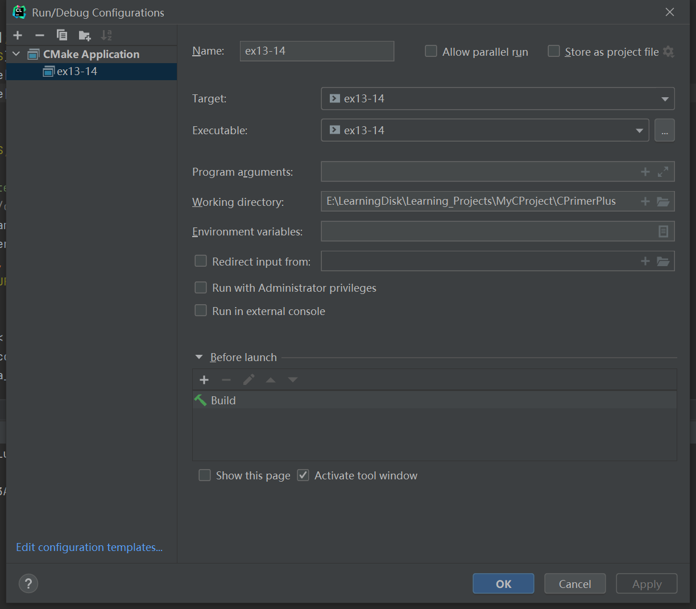

# 习题13.14

&emsp;&emsp;数字图像，尤其是从宇宙飞船发回的数字图像，可能会包含一些失真。为编程练习12添加消除失真的函数。该函数把每个值与它上下左右相邻的值作比较，如果该值与其周围相邻值的差都大于1，则用所有相邻值的平均值（四舍五入为整数）代替该值。注意，与边界上的点相邻的点少于4个，所以做特殊处理。

**解答：**  
代码位置：`exercises/ch13/ex14.c`

```c
#include <string.h>
#include <stdlib.h>
#include <stdio.h>

#define ROWS 20
#define COLS 30
#define LEVELS 10
#define LEN 81
// 数字对应字符
const char trans[LEVELS + 1] = " .':~*=&%#";
// 初始化图片
void init_pic(int rows, int cols, char pic[rows][cols], char ch);

char *s_gets(char *st, int n);
// 消除失真的图像
int clean_distortion(int rows, int cols, int data[rows][cols], int row, int col);
// 转换图片
void trans_pic(int rows, int cols, int data[rows][cols], char pic[rows][cols]);
// 保存图片文件
void save_pic(int rows, int cols, char save_file_name[], char pic[rows][cols]);

int main(void) {
    int row, col;
    // 数据二维数组
    int arr[ROWS][COLS];
    // 图片二维数组
    char pic[ROWS][COLS];
    // 数据文件名
    char data_file_name[LEN];
    // 保存文件名
    char save_file_name[LEN];
    FILE *data_pf;

    // 用$初始化图片二维数组
    init_pic(ROWS, COLS, pic, '$');

    // 提示用户输入数据文件名
    printf("Enter the name of data file:");
    s_gets(data_file_name, LEN);
    // 检查是否能正常打开文件，获取文件句柄
    if ((data_pf = fopen(data_file_name, "r")) == NULL) {
        fprintf(stderr, "Could not open data file %s.\n", data_file_name);
        exit(EXIT_FAILURE);
    }

    // 将数据文件的内容存到数据二维数组中
    for (row = 0; row < ROWS; row++)
        for (col = 0; col < COLS; col++)
            fscanf(data_pf, "%d", &arr[row][col]);

    if (ferror(data_pf)) {
        fprintf(stderr, "Error getting data from file %s.\n", data_file_name);
        exit(EXIT_FAILURE);
    }

    // 消除失真
    for (row = 0; row < ROWS; row++) {
        for (col = 0; col < COLS; col++) {
            arr[row][col] = clean_distortion(ROWS, COLS, arr, row, col);
        }
    }

    // 将数字转换为图片
    trans_pic(ROWS, COLS, arr, pic);

    // 显示图片二维数组
    for (row = 0; row < ROWS; row++) {
        for (col = 0; col < COLS; col++)
            putchar(pic[row][col]);
        putchar('\n');
    }

    // 保存图片
    save_pic(ROWS, COLS, save_file_name, pic);

    return 0;
}

void save_pic(int rows, int cols, char save_file_name[], char pic[rows][cols]) {
    int row, col;
    FILE *save_pf;

    // 提示用户输入保存文件名
    printf("Enter the file name to save:");
    s_gets(save_file_name, LEN);
    if ((save_pf = fopen(save_file_name, "w")) == NULL) {
        fprintf(stderr, "Could not open data file %s.\n", save_file_name);
        exit(EXIT_FAILURE);
    }

    // 将图片二维数组保存到文件中
    for (row = 0; row < rows; row++) {
        for (col = 0; col < cols; col++) {
            fprintf(save_pf, "%c", pic[row][col]);
        }
        putc('\n', save_pf);
    }

    printf("Complete save picture in file %s", save_file_name);

    if (fclose(save_pf) != 0) {
        fprintf(stderr, "Can't close file %s\n", save_file_name);
    }
}

void trans_pic(int rows, int cols, int data[rows][cols], char pic[rows][cols]) {
    int r, c;
    for (r = 0; r < rows; r++)
        for (c = 0; c < cols; c++)
            pic[r][c] = trans[data[r][c]];
}

int clean_distortion(int rows, int cols, int data[rows][cols], int row, int col) {
    int avg;

    if (row == 0) {
        // 处理矩形上边
        if (col == 0) {
            // 处理左上角
            if ((data[row][col] - data[row][col + 1]) > 1 && (data[row][col] - data[row + 1][cols]) > 1) {
                avg = (int) ((data[row][col + 1] + data[row + 1][cols]) / 2.0 + 0.5);
                return avg;
            }
        } else if (col == cols - 1) {
            // 处理右上角
            if ((data[row][col] - data[row][col - 1]) > 1 && (data[row][col] - data[row + 1][cols]) > 1) {
                avg = (int) ((data[row][col - 1] + data[row + 1][cols]) / 2.0 + 0.5);
                return avg;
            }
        } else {
            // 处理上边
            if ((data[row][col] - data[row][col - 1]) > 1 &&
                (data[row][col] - data[row][col + 1]) > 1 &&
                (data[row][col] - data[row + 1][col]) > 1) {
                avg = (int) ((data[row][col - 1] + data[row][col + 1] + data[row + 1][col]) / 3.0 + 0.5);
                return avg;
            }
        }
    } else if (row == rows - 1) {
        // 处理矩形下边
        if (col == 0) {
            // 处理左下角
            if ((data[row][col] - data[row - 1][col]) > 1 && (data[row][col] - data[row][cols + 1]) > 1) {
                avg = (int) ((data[row - 1][col] + data[row][cols + 1]) / 2.0 + 0.5);
                return avg;
            }
        } else if (col == cols - 1) {
            // 处理右下角
            if ((data[row][col] - data[row][col - 1]) > 1 && (data[row][col] - data[row - 1][cols]) > 1) {
                avg = (int) ((data[row][col - 1] + data[row - 1][cols]) / 2.0 + 0.5);
                return avg;
            }
        } else {
            // 处理下边
            if ((data[row][col] - data[row][col - 1]) > 1 &&
                (data[row][col] - data[row][col + 1]) > 1 &&
                (data[row][col] - data[row - 1][col]) > 1) {
                avg = (int) ((data[row][col - 1] + data[row][col + 1] + data[row - 1][col]) / 3.0 + 0.5);
                return avg;
            }
        }
    }

    if (col == 0) {
        // 处理左边
        if ((data[row][col] - data[row - 1][col]) > 1 &&
            (data[row][col] - data[row + 1][col]) > 1 &&
            (data[row][col] - data[row][col + 1]) > 1) {
            avg = (int) ((data[row - 1][col] + data[row + 1][col] + data[row][col + 1]) / 3.0 + 0.5);
            return avg;
        }
    } else if (col == cols - 1) {
        // 处理右边
        if ((data[row][col] - data[row - 1][col]) > 1 &&
            (data[row][col] - data[row + 1][col]) > 1 &&
            (data[row][col] - data[row][col - 1]) > 1) {
            avg = (int) ((data[row - 1][col] + data[row + 1][col] + data[row][col - 1]) / 3.0 + 0.5);
            return avg;
        }
    }
    // 处理剩余的点;
    if ((data[row][col] - data[row - 1][col]) > 1 &&
        (data[row][col] - data[row + 1][col]) > 1 &&
        (data[row][col] - data[row][col - 1]) > 1 &&
        (data[row][col] - data[row][col + 1]) > 1) {
        avg = (int) ((data[row - 1][col] + data[row + 1][col] + data[row][col - 1] + data[row][col + 1]) / 4.0 + 0.5);
        return avg;
    }
    return data[row][col];
}

void init_pic(int rows, int cols, char pic[rows][cols], char ch) {
    int r, c;
    for (r = 0; r < rows; r++)
        for (c = 0; c < cols; c++)
            pic[r][c] = ch;
}

char *s_gets(char *st, int n) {
    char *ret_val;
    char *find;

    ret_val = fgets(st, n, stdin);
    if (ret_val) {
        find = strchr(st, '\n');
        if (find)
            *find = '\0';
        else
            while (getchar() != '\n')
                continue;
    }
    return ret_val;
}
```

该程序需要配置工作目录，用于读取文件相对路径，具体配置信息见下图：


**执行结果：**
```
CPrimerPlus\cmake-build-debug-mingw\ex13-14.exe
Enter the name of data file:exercises/ch13/files/data_file
            *%##%*'
            *%##%**'
            *%.#%*~*'
            *%##%* ~*'
            *%##%*  ~*'
            *%#.%*   ~*'
            *%##%*    ~*'
*************%##%*************
%%%%%%%%%%%%*%##%*%%%%%%%%%%%%
#### #################:#######
%%%%%%%%%%%%*%##%*%%%%%%%%%%%%
*************%##%*************
            *%##%*
            *%##%*    ==
    ''      *%##%*  *=  =*
    ::      *%##%* *=....=*
    ~~      *%##%*  *=  =*
    **      *%##%*    ==
            *%##%*
            *%##%*
Enter the file name to save:exercises/ch13/files/pic_clean_distortion_file
Complete save picture in file exercises/ch13/files/pic_clean_distortion_file
Process finished with exit code 0
```