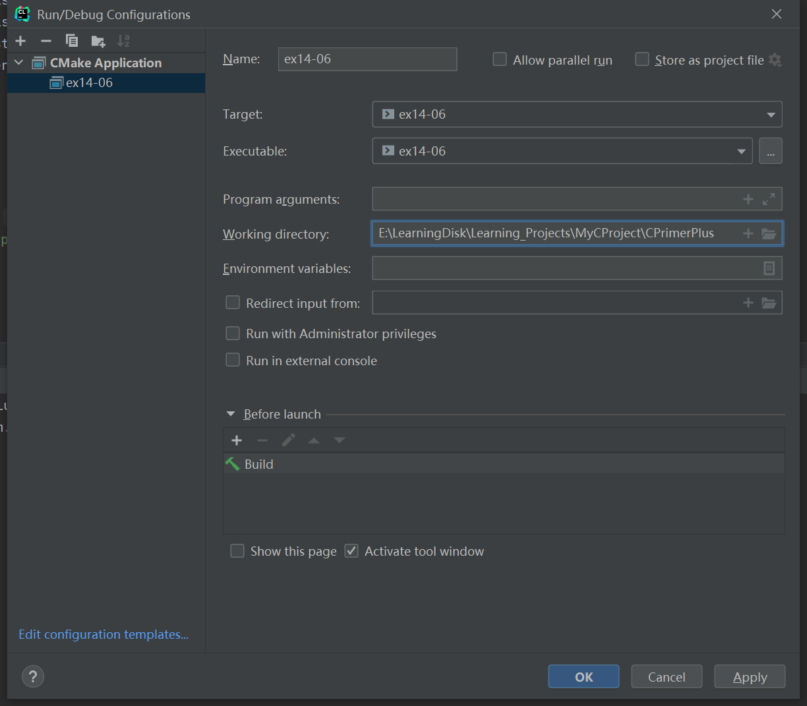

# 习题14.6

&emsp;&emsp;一个文本文件中保存着一个垒球队的信息。每行数据都是这样排列：
```
4 Jessie Joybat 5 2 1 1
```
&emsp;&emsp;第1项时球员号，为方便起见，其范围是0~18；第2项是球员的名；第3项是球员的姓，名和姓都是一个单词；第4项时官方统计的球员上场次数；接着3项分别是击中数、走垒数和打点（RBI）。文件可能包含多场比赛的数据，所以同一位球员可能有多行数据，而且同一位球员的多行数据之间可能有其他球员的数据。编写一个程序，把数据存储到一个结构数组中，该结构中的成员要分别表示球员的名、姓、上场次数、击中数、走垒数、打点数和安打率（稍后计算）。可以使用球员号作为数组的索引。该程序要读到文件结尾，并统计每位球员的各项累计总和。  
&emsp;&emsp;实际棒球统计与之相关。例如，一次走垒和触垒中的失误不计入上场次数，但是可能产生一个RBI，但是该程序要做的就像下面描述的一样读取和处理数据文件，不会关心数据的实际含义。  
&emsp;&emsp;要实现这些功能，最简单的方法是把结构的内容都初始化为零，把文件中的数据读入临时变量中，然后将其加入相应的结构中。程序读完文件后，应计算每位球员的安打率，并把计算结果存储到结构的相应成员中。计算安打率是用球员的累计击中数除以上场累计次数，这是一个浮点数计算。最后，程序结合整个球队的统计数据，一行显示一位球员的累计数据。

**解答：**  
代码位置：`exercises/ch14/ex06.c`  
```c
#include <stdlib.h>
#include <string.h>
#include <stdio.h>

#define FIEL_PATH "exercises/ch14/files/baseball_team.dat"
#define LEN 15

struct player {
    // 球员号
    int id;
    // 球员的名
    char first_name[20];
    // 球员的姓
    char last_name[20];
    // 上场次数
    int game_times;
    // 击中数
    int hit_num;
    // 走垒数
    int base_num;
    // 打点
    int RBI;
    // 安打率
    float BABIP;
};

// 读取数据文件
void read_data(struct player list[], FILE *fp);
int get_list_index(struct player list[], int n, int id, int cur_index);
// 设置安打率
void set_babip(struct player list[], int n);
// 打印结果
void show_info(struct player list[], int n);

struct player players[LEN];

int main(void) {
    FILE *fp;

    // 检查文件是否打开正常，并打开数据文件
    if ((fp = fopen(FIEL_PATH, "r")) == NULL) {
        printf("Can't open the file %s\n", FIEL_PATH);
        exit(EXIT_FAILURE);
    }
    // 读取数据
    read_data(players, fp);
    // 计算安打率
    set_babip(players, LEN);
    // 打印球队的统计数据
    show_info(players, LEN);

    fclose(fp);
    return 0;
}

void read_data(struct player list[], FILE *fp) {
    int id, game_times, hit_num, base_num, RBI;
    char first_name[20], last_name[20];
    int list_index;
    int list_length = 0;
    // 读取数据文件，并存储到临时结构数组中
    while ((fscanf(fp,
                   "%d %s %s %d %d %d %d",
                   &id, first_name, last_name, &game_times, &hit_num, &base_num, &RBI)) == 7) {
        // 返回数组索引
        list_index = get_list_index(list, LEN, id, list_length);
        if (list_index == list_length) {
            list_length++;
        }
        strcpy(list[list_index].first_name, first_name);
        strcpy(list[list_index].last_name, last_name);
        list[list_index].id = id;
        list[list_index].game_times += game_times;
        list[list_index].hit_num += hit_num;
        list[list_index].base_num += base_num;
        list[list_index].RBI += RBI;
    }
}

int get_list_index(struct player list[], int n, int id, int cur_index) {
    for (int i = 0; i < n; i++) {
        if (list[i].id == id) {
            return i;
        }
    }

    return cur_index;
}

// 计算安打率
void set_babip(struct player list[], int n) {
    for (int i = 0; i < n; i++) {
        list[i].BABIP = (float) list[i].hit_num / (float) list[i].game_times;
    }
}

void show_info(struct player list[], int n) {
    printf("ID: First_Name.Last_Name Game_Times Hit_Num Base_Num RBI BABIP\n");
    for (int i = 0; i < n; i++) {
        printf("%2d %10s.%-10s %5d %10d %7d %5d %5.2f\n",
               list[i].id, list[i].first_name, list[i].last_name,
               list[i].game_times, list[i].hit_num, list[i].base_num, list[i].RBI, list[i].BABIP);
    }
}
```

该程序需要配置工作目录，用于读取文件相对路径，具体配置信息见下图：


数据文件位置：`exercises/ch14/files/baseball_team.dat`
```
1 Aubree Munro 7 3 2 1
2 Ali Aguilar 4 1 1 0
3 Ally Carda 3 1 0 0
4 Jessie Joybat 5 2 1 1
5 Kelsey Stewart 2 1 0 1
6 Haylie Cleney 3 0 0 1
7 Janie Reed 3 1 2 1
8 Monica Abbott 1 1 1 0
9 Michelle Moultrie 2 1 1 0
10 Valerie Arioto 3 1 0 1
11 Rachel Garcia 4 2 1 1
12 Dejah Mulipola 3 1 0 0
13 Cat Osterman 2 1 0 0
14 Bubba Nickles 2 1 0 1
15 Delaney Spaulding 2 0 1 1
1 Aubree Munro 8 3 2 1
2 Ali Aguilar 9 1 1 0
3 Ally Carda 3 1 0 0
4 Jessie Joybat 4 2 1 1
5 Kelsey Stewart 3 1 0 1
6 Haylie Cleney 5 1 0 1
7 Janie Reed 4 1 2 1
8 Monica Abbott 2 1 1 0
9 Michelle Moultrie 3 1 1 0
10 Valerie Arioto 2 1 0 1
7 Janie Reed 5 1 2 1
8 Monica Abbott 4 1 1 0
9 Michelle Moultrie 4 1 1 0
10 Valerie Arioto 6 1 0 1
11 Rachel Garcia 8 2 2 1
12 Dejah Mulipola 7 1 0 0
13 Cat Osterman 5 3 1 0
14 Bubba Nickles 6 1 3 1
```

**执行结果：**
```
CPrimerPlus\cmake-build-debug-mingw\ex14-06.exe
ID: First_Name.Last_Name Game_Times Hit_Num Base_Num RBI BABIP
 1     Aubree.Munro         15          6       4     2  0.40
 2        Ali.Aguilar       13          2       2     0  0.15
 3       Ally.Carda          6          2       0     0  0.33
 4     Jessie.Joybat         9          4       2     2  0.44
 5     Kelsey.Stewart        5          2       0     2  0.40
 6     Haylie.Cleney         8          1       0     2  0.13
 7      Janie.Reed          12          3       6     3  0.25
 8     Monica.Abbott         7          3       3     0  0.43
 9   Michelle.Moultrie       9          3       3     0  0.33
10    Valerie.Arioto        11          3       0     3  0.27
11     Rachel.Garcia        12          4       3     2  0.33
12      Dejah.Mulipola      10          2       0     0  0.20
13        Cat.Osterman       7          4       1     0  0.57
14      Bubba.Nickles        8          2       3     2  0.25
15    Delaney.Spaulding      2          0       1     1  0.00

Process finished with exit code 0
```