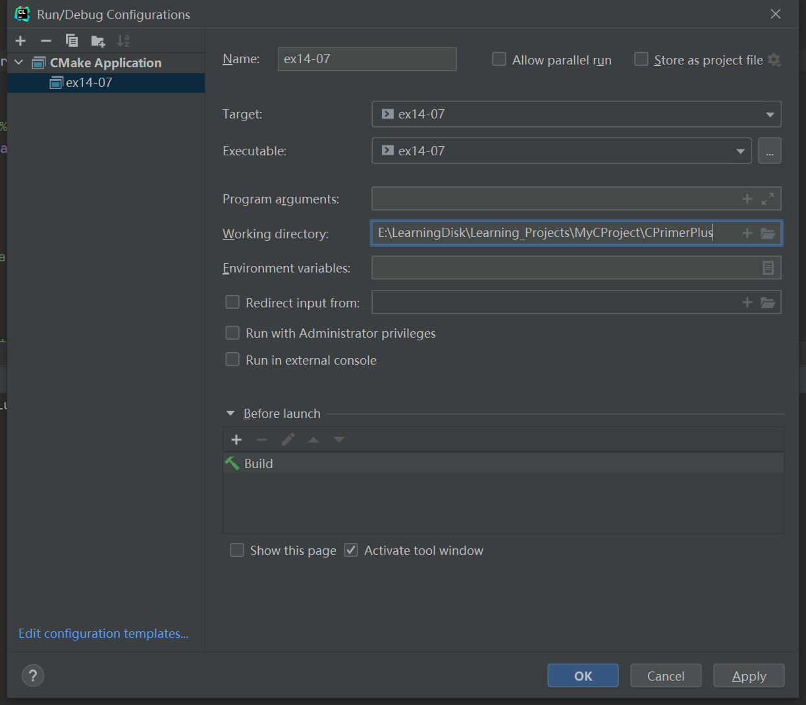

# 习题14.7

&emsp;&emsp;修改程序清单14.14，从文件中读取每条记录并显示出来，允许用户删除记录或修改记录的内容。如果删除记录，把空出来的空间留给下一个要读入的记录。要修改现有的文件记录，必须用`r+b`模式，而不是`a+b`模式。而且，必须更加注意定位文件指针，防止新加入的记录覆盖现有记录。最简单的方法是改动存储在内存中的所有数据，然后再把最后的信息写入文件。其中的一个方法是在`book`结构中添加一个成员表示是否该项被删除。

**解答：**  
代码位置：`exercises/ch14/ex07.c`
```c
#include <stdio.h>
#include <stdlib.h>
#include <string.h>
#include <stdbool.h>

#define MAXTITL  100
#define MAXAUTL  40
// 最大书籍数量
#define MAXBKS   20
// 书籍文件
#define FIEL_PATH "exercises/ch14/files/book.dat"

char *s_gets(char *st, int n);

struct book {
    // 书名
    char title[MAXTITL];
    // 作者
    char author[MAXAUTL];
    // 价格
    double value;
    // 删除标记
    int delete_flag;
};

void show_library(const struct book library[], int count, int show_del_flag);
static void clear_input(void);

int main(void) {
    struct book library[MAXBKS];
    int count = 0;
    int filecount;
    FILE *pbooks;
    int size = sizeof(struct book);
    char delete;

    // 检查文件是否打开正常，并获取文件句柄
    if ((pbooks = fopen(FIEL_PATH, "r+b")) == NULL) {
        fputs("Can't open book.dat file\n", stderr);
        exit(EXIT_FAILURE);
    }

    // 定位到文件开始处
    rewind(pbooks);
    // 读取文件，采用原结构体保存到数组中
    while (count < MAXBKS && fread(&library[count], sizeof(struct book), 1, pbooks) == 1) {
        if (count == 0)
            puts("Current contents of book.dat:");
        if (library[count].delete_flag != 1) {
            printf("No.%d %s by %s: $%.2f\n", count + 1, library[count].title,
                   library[count].author, library[count].value);
        }
        count++;
    }

    filecount = count;
    // 判断数量是否溢出
    if (count == MAXBKS) {
        fputs("The book.dat file is full.", stderr);
        exit(2);
    }

    // 提示用户是否要删除书籍
    printf("\nDo you want to modify library? (y/n):");
    while (scanf("%c", &delete) == 1 && delete == 'y') {
        clear_input();
        // 提示用户选择要删除的书号
        printf("Which book do you want to delete? (1 to %d):", filecount);
        int book_num;
        scanf("%d", &book_num);
        clear_input();
        // 再次提示用户是否要删除
        printf("Do you want to delete this book [%s]? (y/n):", library[book_num - 1].title);
        scanf("%c", &delete);
        if (delete == 'y') {
            // 设置删除标记
            library[book_num - 1].delete_flag = 1;
        }
        clear_input();
        show_library(library, filecount, false);
        printf("\nDo you want to modify library? (y/n):");
    }

    clear_input();
    /*
     * input:
     * 10 Steps to Earning Awesome Grades
     * Thomas Frank
     * 19.62
     */
    // 提示用户添加新书
    puts("Please add new book titles.");
    puts("Press [enter] at the start of a line to stop.");
    while (count < MAXBKS && s_gets(library[count].title, MAXTITL) != NULL
           && library[count].title[0] != '\0' && library[count].delete_flag != 1) {
        // 提示用户输入作者
        puts("Now enter the author.");
        s_gets(library[count].author, MAXAUTL);
        // 提示用户输入价格
        puts("Now enter the value.");
        scanf("%lf", &library[count].value);
        // 设置删除状态为0
        library[count++].delete_flag = 0;
        clear_input();
        if (count < MAXBKS)
            puts("Enter the next title.");
    }

    if (count > 0) {
        // 打印所有书籍信息，包括已标记删除的书籍
        show_library(library, count, true);
        // 将数据写入到文件中
        fwrite(&library[filecount], size, count - filecount,
               pbooks);
    } else
        puts("No books? Too bad.");

    puts("Bye.");
    fclose(pbooks);

    return 0;
}

void show_library(const struct book library[], int count, int show_del_flag) {
    int index;
    puts("Here is the list of your books:");
    if (show_del_flag) {
        // 展示所有书籍
        for (index = 0; index < count; index++) {
            printf("No.%d %s by %s: $%.2f, booked_status: %s\n", index + 1, library[index].title,
                   library[index].author, library[index].value, library[index].delete_flag == 1 ? "delete" : "exist");
        }
    } else {
        // 仅展示未删除的书籍
        for (index = 0; index < count; index++) {
            if (library[index].delete_flag != 1) {
                printf("No.%d %s by %s: $%.2f\n", index + 1, library[index].title,
                       library[index].author, library[index].value);
            }
        }
    }
}

char *s_gets(char *st, int n) {
    char *ret_val;
    char *find;

    ret_val = fgets(st, n, stdin);
    if (ret_val) {
        find = strchr(st, '\n');   // look for newline
        if (find)                  // if the address is not NULL,
            *find = '\0';          // place a null character there
        else
            while (getchar() != '\n')
                continue;          // dispose of rest of line
    }
    return ret_val;
}

static void clear_input(void) {
    while (getchar() != '\n')
        continue;
}
```

该程序需要配置工作目录，用于读取文件相对路径，具体配置信息见下图：


可使用`exercises/ch14/files/create-book-data.c`代码生成`book.dat`数据文件，执行结果如下（打印书籍信息及是否删除的状态）：
```
CPrimerPlus\cmake-build-debug-mingw\create-book-data.exe
Here is the list of your books:
My Life as a Budgie by Mack Zackles: $12.96, booked_status: exist
Thought and Unthought Rethought by Kindra Schlagmeyer: $43.50, booked_status: exist
Concerto for Financial Instruments by Filmore Walletz: $49.99, booked_status: exist
The CEO Power Diet by Buster Downsize: $19.25, booked_status: exist
C++ Primer Plus by Stephen Prata: $59.99, booked_status: exist
Fact Avoidance: Perception as Reality by Polly Bull: $19.97, booked_status: exist
Coping with Coping by Dr. Rubin Thonkwacker: $0.02, booked_status: exist
Diaphanous Frivolity by Neda McFey: $29.99, booked_status: exist
Murder Wore a Bikini by Mickey Splats: $18.95, booked_status: exist
A History of Buvania, Volume 8 by Prince Nikoli Buvan: $50.04, booked_status: exist
Mastering Your Digital Watch, 5nd Edition by Miklos Mysz: $28.95, booked_status: exist
A Foregone Confusion by Phalty Reasoner: $5.99, booked_status: exist
Outsourcing Government: Selection vs. Election by Ima Pundit: $33.33, booked_status: exist
Start write to file...
File exercises/ch14/files/book.dat write correct!

Start read file...
Current contents of book.dat:
My Life as a Budgie by Mack Zackles: $12.96, booked_status: exist
Thought and Unthought Rethought by Kindra Schlagmeyer: $43.50, booked_status: exist
Concerto for Financial Instruments by Filmore Walletz: $49.99, booked_status: exist
The CEO Power Diet by Buster Downsize: $19.25, booked_status: exist
C++ Primer Plus by Stephen Prata: $59.99, booked_status: exist
Fact Avoidance: Perception as Reality by Polly Bull: $19.97, booked_status: exist
Coping with Coping by Dr. Rubin Thonkwacker: $0.02, booked_status: exist
Diaphanous Frivolity by Neda McFey: $29.99, booked_status: exist
Murder Wore a Bikini by Mickey Splats: $18.95, booked_status: exist
A History of Buvania, Volume 8 by Prince Nikoli Buvan: $50.04, booked_status: exist
Mastering Your Digital Watch, 5nd Edition by Miklos Mysz: $28.95, booked_status: exist
A Foregone Confusion by Phalty Reasoner: $5.99, booked_status: exist
Outsourcing Government: Selection vs. Election by Ima Pundit: $33.33, booked_status: exist

Process finished with exit code 0
```

**执行结果：**
```
CPrimerPlus\cmake-build-debug-mingw\ex14-07.exe
Current contents of book.dat:
No.1 My Life as a Budgie by Mack Zackles: $12.96
No.2 Thought and Unthought Rethought by Kindra Schlagmeyer: $43.50
No.3 Concerto for Financial Instruments by Filmore Walletz: $49.99
No.4 The CEO Power Diet by Buster Downsize: $19.25
No.5 C++ Primer Plus by Stephen Prata: $59.99
No.6 Fact Avoidance: Perception as Reality by Polly Bull: $19.97
No.7 Coping with Coping by Dr. Rubin Thonkwacker: $0.02
No.8 Diaphanous Frivolity by Neda McFey: $29.99
No.9 Murder Wore a Bikini by Mickey Splats: $18.95
No.10 A History of Buvania, Volume 8 by Prince Nikoli Buvan: $50.04
No.11 Mastering Your Digital Watch, 5nd Edition by Miklos Mysz: $28.95
No.12 A Foregone Confusion by Phalty Reasoner: $5.99
No.13 Outsourcing Government: Selection vs. Election by Ima Pundit: $33.33

Do you want to modify library? (y/n):y
Which book do you want to delete? (1 to 13):12
Do you want to delete this book [A Foregone Confusion]? (y/n):y
Here is the list of your books:
No.1 My Life as a Budgie by Mack Zackles: $12.96
No.2 Thought and Unthought Rethought by Kindra Schlagmeyer: $43.50
No.3 Concerto for Financial Instruments by Filmore Walletz: $49.99
No.4 The CEO Power Diet by Buster Downsize: $19.25
No.5 C++ Primer Plus by Stephen Prata: $59.99
No.6 Fact Avoidance: Perception as Reality by Polly Bull: $19.97
No.7 Coping with Coping by Dr. Rubin Thonkwacker: $0.02
No.8 Diaphanous Frivolity by Neda McFey: $29.99
No.9 Murder Wore a Bikini by Mickey Splats: $18.95
No.10 A History of Buvania, Volume 8 by Prince Nikoli Buvan: $50.04
No.11 Mastering Your Digital Watch, 5nd Edition by Miklos Mysz: $28.95
No.13 Outsourcing Government: Selection vs. Election by Ima Pundit: $33.33

Do you want to modify library? (y/n):n
Please add new book titles.
Press [enter] at the start of a line to stop.
10 Steps to Earning Awesome Grades
Now enter the author.
Thomas Frank
Now enter the value.
19.62
Enter the next title.

Here is the list of your books:
No.1 My Life as a Budgie by Mack Zackles: $12.96, booked_status: exist
No.2 Thought and Unthought Rethought by Kindra Schlagmeyer: $43.50, booked_status: exist
No.3 Concerto for Financial Instruments by Filmore Walletz: $49.99, booked_status: exist
No.4 The CEO Power Diet by Buster Downsize: $19.25, booked_status: exist
No.5 C++ Primer Plus by Stephen Prata: $59.99, booked_status: exist
No.6 Fact Avoidance: Perception as Reality by Polly Bull: $19.97, booked_status: exist
No.7 Coping with Coping by Dr. Rubin Thonkwacker: $0.02, booked_status: exist
No.8 Diaphanous Frivolity by Neda McFey: $29.99, booked_status: exist
No.9 Murder Wore a Bikini by Mickey Splats: $18.95, booked_status: exist
No.10 A History of Buvania, Volume 8 by Prince Nikoli Buvan: $50.04, booked_status: exist
No.11 Mastering Your Digital Watch, 5nd Edition by Miklos Mysz: $28.95, booked_status: exist
No.12 A Foregone Confusion by Phalty Reasoner: $5.99, booked_status: delete
No.13 Outsourcing Government: Selection vs. Election by Ima Pundit: $33.33, booked_status: exist
No.14 10 Steps to Earning Awesome Grades by Thomas Frank: $19.62, booked_status: exist
Bye.

Process finished with exit code 0
```