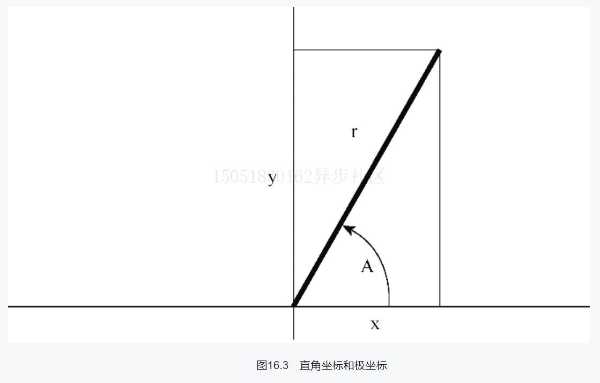

# 习题16.3

&emsp;&emsp;极坐标用向量的模（即向量的长度）和向量相对`x`轴逆时针旋转的角度来描述该向量。直角坐标用向量的`x`轴和`y`轴的坐标来描述该向量（见图16.3）。编写一个程序，读取向量的模和角度（单位：度），然后显示`x`轴和`y`轴的坐标。相关方程如下：
$$
\begin{array}{ll}
x = r \cdot \cos(A) \\
y = r \cdot \sin(A) 
\end{array}
$$
需要一个函数来完成转换，该函数接受一个包含极坐标的结构，并返回一个包含直角坐标的结构（或返回指向该结构的指针）。


**解答：**  
代码位置：`exercises/ch16/ex03.c`

```c
#include <stdio.h>
#include <math.h>

// 定义极坐标的结构
struct polar {
    double r;
    double theta;
};
// 定义直角坐标的结构
struct rect {
    double x;
    double y;
};

// 极坐标转直角坐标
struct rect polar_to_rect(const struct polar * p);

int main(void) {
    struct polar input;
    struct rect result;

    // 提示用户输入向量的模和角度
    printf("Enter magnitude and angle in degrees:");
    while (scanf("%lf %lf", &input.r, &input.theta) == 2) {
        // 将极坐标转换成直角坐标
        result = polar_to_rect(&input);
        // 打印结果
        printf("Polar Coord: %g %g\n", input.r, input.theta);
        printf("Rectangular Coord: %g %g\n", result.x, result.y);
        printf("Enter magnitude and angle in degrees (q to quit):");
    }

    printf("Bye\n");
    return 0;
}

struct rect polar_to_rect(const struct polar * p) {
    static const double deg_rad = M_PI / 180.0;
    struct rect result;
    // 得到弧度
    double ang = deg_rad * p->theta;

    // 计算直角坐标的两个值
    result.x = p->r * cos(ang);
    result.y = p->r * sin(ang);

    return result;
}
```

**执行结果：**
```
CPrimerPlus\cmake-build-debug-mingw\ex16-03.exe
Enter magnitude and angle in degrees:2 30
Polar Coord: 2 30
Rectangular Coord: 1.73205 1
Enter magnitude and angle in degrees (q to quit):1.414 45
Polar Coord: 1.414 45
Rectangular Coord: 0.999849 0.999849
Enter magnitude and angle in degrees (q to quit):q
Bye

Process finished with exit code 0
```