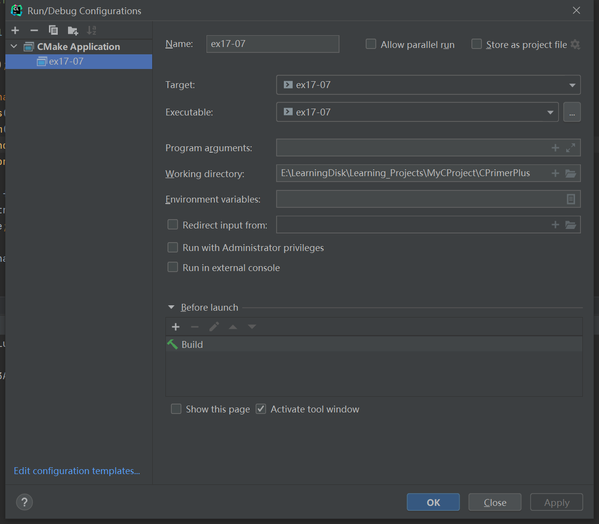

# 习题17.7

&emsp;&emsp;编写一个程序，打开和读取一个文本文件，并统计文件中每个单词出现的次数。用改进的二叉查找树存储单词及其出现的次数。程序在读入文件后，会提供一个有3个选项的菜单。第1个选项是列出所有的单词和出现的次数。第2个选项是让用户输入一个单词，程序报告该单词在文件中出现的次数。第3个选项是退出。

**解答：**  
`tree.h`头文件  
代码位置：`exercises/ch17/ex07/tree.h`，拷贝示例代码（程序清单17.10），需要修改部分如下：

```c
// 单词的最大长度
#define SLEN 81
typedef struct item {
    char word[SLEN];
    // 单词出现的次数
    int count;
} Item;
```

`tree.c`源文件  
代码位置：`exercises/ch17/ex07/tree.c`，拷贝示例代码（程序清单17.11），需要修改部分如下：
```c
bool AddItem(const Item *pi, Tree *ptree) {
    Trnode *new_node;
    Pair seek;

    if (TreeIsFull(ptree)) {
        fprintf(stderr, "Tree is full\n");
        return false;
    }
    if ((seek = SeekItem(pi, ptree)).child != NULL) {
        // 如果输入数据重复 则在原数据上的标记数量加 1
        seek.child->item.count++;
        return true;
    }
    new_node = MakeNode(pi);
    if (new_node == NULL) {
        fprintf(stderr, "Couldn't create node\n");
        return false;
    }
    // 成功创建一个新节点
    ptree->size++;

    if (ptree->root == NULL) {
        // 树为空，新节点为树的根节点
        ptree->root = new_node;
    } else {
        // 不为空，在树中添加新节点
        AddNode(new_node, ptree->root);
    }

    return true;
}

void find_word(const Tree * pt) {
    Item temp;
    Pair pair;
    int t;

    printf("Enter the word you search:\n");
    scanf("%s",temp.word);
    while(getchar() != '\n');
    pair = SeekItem(&temp,pt);
    if(pair.child == NULL)
        printf("No entries!\n");
    else
    {
        t = pair.child->item.count;
        printf("%s appears %d times\n",temp.word,t);
    }
}
```

主程序源文件  
代码位置：`exercises/ch17/ex07/ex07.c`
```c
#include <stdio.h>
#include <string.h>
#include <stdlib.h>
#include <ctype.h>
#include "tree.h"

#define SLEN 81

char menu(void);

char *s_gets(char *st, int n);
void show_words(const Tree * ptree);
void print_item(Item item);
extern void find_word(const Tree * pt);
void process_word(char *word, int n);

int main(void) {
    Tree word_tree;
    char choice;
    FILE *fp;
    char file_name[SLEN];
    Item temp;

    printf("Enter the name of file to be processed:");
    // input exercises/ch17/ex07/wordy
    s_gets(file_name, SLEN);
    if ((fp = fopen(file_name, "r")) == NULL) {
        printf("Can't open file %s\n", file_name);
        exit(EXIT_FAILURE);
    }

    // 初始化二叉查找树
    InitializeTree(&word_tree);
    while (fscanf(fp, "%s", temp.word) == 1 && !TreeIsFull(&word_tree)) {
        process_word(temp.word, strlen(temp.word));
        temp.count = 1;
        AddItem(&temp, &word_tree);
    }

    // 关闭文件
    if (fclose(fp) != 0){
        printf("Can't close file %s\n", file_name);
        exit(EXIT_FAILURE);
    }

    // 提示用户选择一个选项
    printf("file is opened,what do you want to do:\n");
    while ((choice = menu()) != 'q') {
        switch (choice) {
            case 's':
                // 列出所有单词及其出现的次数
                show_words(&word_tree);
                break;
            case 'f':
                // 查找单词，并报告该单词在文件中出现的次数
                find_word(&word_tree);
                break;
            default:
                printf("Error choice!\n");
        }
    }

    puts("Bye!");
    DeleteAll(&word_tree);

    return 0;
}

void process_word(char *word, int n) {
    int i;
    for (i = 0; i < n; i++) {
        word[i] = tolower(word[i]);
        if (ispunct(word[i])) {
            word[i] = '\0';
            break;
        }
    }
}

void show_words(const Tree * ptree) {
    printf("Here is the word list:\n");
    if (TreeIsEmpty(ptree)) {
        printf("No entries!\n");
    } else {
        Traverse(ptree, print_item);
    }
}

void print_item(Item item) {
    // 打印单词及其出现的次数
    printf("%s: %3d\n", item.word, item.count);
}

char menu(void) {
    int ch;

    printf("Enter the letter corresponding to your choice:\n");
    printf("s) show word list      f) find a word\n");
    printf("q) quit\n");

    while ((ch = getchar()) != EOF) {
        while (getchar() != '\n')
            continue;

        ch = tolower(ch);
        if (strchr("sfq", ch) == NULL) {
            printf("Please enter an s, f or q:");
        } else {
            break;
        }
    }

    if (ch == EOF) {
        ch = 'q';
    }

    return (char) ch;
}

char *s_gets(char *st, int n) {
    char *ret_val;
    char *find;

    ret_val = fgets(st, n, stdin);
    if (ret_val) {
        find = strchr(st, '\n');   // look for newline
        if (find)                  // if the address is not NULL,
            *find = '\0';          // place a null character there
        else
            while (getchar() != '\n')
                continue;          // dispose of rest of line
    }
    return ret_val;
}
```

该程序需要配置工作目录，用于读取文件相对路径，具体配置信息见下图：


`wordy`文件位置：`exercises/ch17/ex07/wordy`  
```
From fairest creatures we desire increase,
That thereby beauty's rose might never die,
But as the riper should by time decease,
His tender heir might bear his memory;
But thou contracted to thine own bright eyes,
Feeds thy light's flame with self-substantial fuel,
Making a famine where abundance lies,
Thyself thy foe, to thy sweet self too cruel.
Thou that art now the world's fresh ornament,
And only herald to the gaudy spring,
Within thine own bud buriest thy content,
And, tender churl, makes waste in niggarding.
Pity the world, or else this glutton be,
To eat the world's due, by the grave and thee.
```

**执行结果：**
```
CPrimerPlus\cmake-build-debug-mingw\ex17-07.exe
Enter the name of file to be processed:exercises/ch17/ex07/wordy
file is opened,what do you want to do:
Enter the letter corresponding to your choice:
s) show word list      f) find a word
q) quit
s
Here is the word list:
a:   1
abundance:   1
and:   3
art:   1
as:   1
be:   1
bear:   1
beauty:   1
bright:   1
bud:   1
buriest:   1
but:   2
by:   2
churl:   1
content:   1
contracted:   1
creatures:   1
cruel:   1
decease:   1
desire:   1
die:   1
due:   1
eat:   1
else:   1
eyes:   1
fairest:   1
famine:   1
feeds:   1
flame:   1
foe:   1
fresh:   1
from:   1
fuel:   1
gaudy:   1
glutton:   1
grave:   1
heir:   1
herald:   1
his:   2
in:   1
increase:   1
lies:   1
light:   1
makes:   1
making:   1
memory:   1
might:   2
never:   1
niggarding:   1
now:   1
only:   1
or:   1
ornament:   1
own:   2
pity:   1
riper:   1
rose:   1
self:   2
should:   1
spring:   1
sweet:   1
tender:   2
that:   2
the:   6
thee:   1
thereby:   1
thine:   2
this:   1
thou:   2
thy:   4
thyself:   1
time:   1
to:   4
too:   1
waste:   1
we:   1
where:   1
with:   1
within:   1
world:   3
Enter the letter corresponding to your choice:
s) show word list      f) find a word
q) quit
f
Enter the word you search:
the
the appears 6 times
Enter the letter corresponding to your choice:
s) show word list      f) find a word
q) quit
f
Enter the word you search:
world
world appears 3 times
Enter the letter corresponding to your choice:
s) show word list      f) find a word
q) quit
q
Bye!

Process finished with exit code 0
```